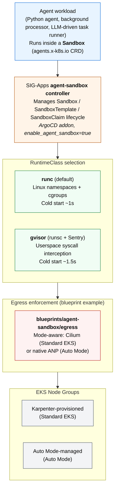

# Agent Sandbox on EKS — Solution Blueprint

## Table of Contents

- [Overview](#overview)
- [Architecture](#architecture)
- [Components](#components)
- [Plan Your Deployment](#plan-your-deployment)
  - [AWS Services](#aws-services)
  - [Cost](#cost)
- [Security](#security)
- [Prerequisites](#prerequisites)
- [Quick Start Guide](#quick-start-guide)
  - [Deploy the Infrastructure](#deploy-the-infrastructure)
  - [Apply the Platform Manifests](#apply-the-platform-manifests)
  - [Layer a Blueprint](#layer-a-blueprint)
  - [Basic Sandbox Configuration](#basic-sandbox-configuration)
- [Configuration Options](#configuration-options)
- [Troubleshooting](#troubleshooting)
- [Cleanup](#cleanup)

## Overview

This solution deploys a secure, FQDN-filtered Kubernetes environment for running isolated AI agent workloads on Amazon EKS. It combines the [kubernetes-sigs/agent-sandbox](https://github.com/kubernetes-sigs/agent-sandbox) controller (CRD-driven sandbox lifecycle management) with runtime-level isolation tiers (`runc` = Linux namespace+cgroup isolation, `gvisor` = userspace syscall interception via [runsc](https://gvisor.dev/)) and composable egress enforcement (chained Cilium FQDN filtering today, EKS-native `ApplicationNetworkPolicy` on Auto Mode).

Agents that execute model-generated code need two guarantees the default Kubernetes pod doesn't provide:

- **Kernel boundary isolation**: untrusted code running inside the sandbox must not have access to the host kernel's full syscall surface. gVisor's Sentry intercepts syscalls in userspace and serves a restricted subset; Kata+Firecracker (documented as a future tier) adds hardware-virtualization boundaries.
- **Egress policy enforcement**: agents call LLM APIs, package registries, and developer tools. Without an allowlist, a compromised agent can exfiltrate data or probe internal services. FQDN filtering limits egress to a pre-approved set of destinations.

This solution delivers both. The reference agent (under [`../../blueprints/agent-sandbox/`](../../blueprints/agent-sandbox/)) exercises the full chain: provisions inside a gVisor-isolated Sandbox, fetches credentials via IRSA, calls Amazon Bedrock for content, executes model-generated code inside the Sentry boundary, and demonstrates both enforcement layers (FQDN block at DNS proxy + L3/L4 block at eBPF).

## Architecture



Two composition paths ship with the blueprint that layers on top of this infra:

- **SandboxClaim** ([`blueprints/agent-sandbox/manifests/sandbox-agent.yaml`](../../blueprints/agent-sandbox/manifests/sandbox-agent.yaml)) — a thin claim that points at one of the SandboxTemplates plus the per-deployment glue (ServiceAccount + agent-script ConfigMap). The runtime spec lives in the template; the claim picks the tier. Native to the SIG-Apps Sandbox API.
- **KRO AgentSandbox** ([`blueprints/agent-sandbox/manifests/kro/`](../../blueprints/agent-sandbox/manifests/kro/)) — the same workload composed via a single `AgentSandbox` custom resource. The `ResourceGraphDefinition` takes a `runtimeClass`, `iamRoleArn`, `scriptConfigMap`, and Bedrock region/model and materializes the SA + Sandbox in one declarative unit. Useful when exposing a simpler surface to your team.

Both paths produce equivalent running pods. Each tier (`runc`, `gvisor`) is a SandboxTemplate the claim or AgentSandbox can target.

## Components

| Component | Version | Purpose |
|-----------|---------|---------|
| [kubernetes-sigs/agent-sandbox](https://github.com/kubernetes-sigs/agent-sandbox) | v0.4.5 | Sandbox / SandboxTemplate / SandboxClaim controller (base infra ArgoCD addon, `enable_agent_sandbox`) |
| [kro](https://kro.run/) | 0.9.1 | ResourceGraphDefinition-based composition (base infra ArgoCD addon, `enable_kro`; optional) |
| [gVisor](https://gvisor.dev/) | runsc (AL2023) | Userspace syscall interception for gvisor tier (installed via Karpenter NodePool user-data) |
| [Karpenter](https://karpenter.sh/) | Bundled with base module | Node autoscaling with a dedicated gVisor NodePool (Standard EKS) |
| [Cilium](https://cilium.io/) + [Hubble](https://github.com/cilium/hubble) | 1.16.x | FQDN egress enforcement + flow observability (base infra ArgoCD addon, `enable_cilium`; optional, used by the egress blueprint example) |
| VPC CNI (`ApplicationNetworkPolicy`) | v1.21.1+ | Native FQDN egress enforcement on Auto Mode (used by the egress blueprint example) |

### Runtime tiers

Each tier is a weaker boundary than the one below it — tier choice maps to a threat model, not a "is it secure enough?" question.

| Tier | Boundary | Protects against | Does NOT protect against |
|------|----------|------------------|--------------------------|
| `runc` (basic) | Linux namespaces + seccomp | Other pods in the cluster (network policies + RBAC) | Host kernel exploitation, syscall abuse, cgroup escapes |
| `gvisor` (runsc + Sentry) | Userspace syscall interception | Host kernel exploitation for ~99% of common syscalls (Sentry serves restricted subset). Malicious binaries cannot directly invoke host kernel. | Cold-start overhead (~60-90s for first pod per node); some specialized syscalls fall back to host (ptrace, certain perf paths); Sentry itself is a trusted computing base |
| Kata + Firecracker (future) | Hardware-enforced microVM (KVM) | All of the above, including hardware-level side channels. Each sandbox gets its own VM with isolated CPU state. | Not shipped in this solution — requires nested virtualization support which EKS Managed Node Groups do not yet provide. See [tracking issue](https://github.com/awslabs/ai-on-eks/issues) for status. |

### Tier selection

1. Does your agent execute untrusted code (prompts that generate + run code, user-uploaded scripts, model-generated shell)?
   - **Yes** → `gvisor` or Kata+Firecracker (once available). Syscall isolation is the differentiator.
   - **No** → `runc` may be sufficient; network policy + RBAC still apply.

2. Does your threat model include malicious first-party code (a compromised agent image, an insider-threat scenario)?
   - **Yes** → Kata+Firecracker (hardware boundary) when available.
   - **No** → `gvisor` is still a reasonable default for code-executing agents even in single-tenant deployments.

## Plan Your Deployment

### AWS Services

| AWS Service | Role | Description |
|-------------|------|-------------|
| [Amazon EKS](https://aws.amazon.com/eks/) | Core | Managed Kubernetes control plane |
| [Amazon EC2](https://aws.amazon.com/ec2/) | Core | Compute instances for Karpenter NodePools (incl. gVisor-capable nodes) |
| [Amazon VPC](https://aws.amazon.com/vpc/) | Core | Private networking with NAT for egress |
| [Amazon Bedrock](https://aws.amazon.com/bedrock/) | Optional | LLM inference for the reference agent (other providers reachable via egress allowlist) |
| [AWS IAM](https://aws.amazon.com/iam/) | Security | IRSA-based credential injection (`eks.amazonaws.com/role-arn`) |
| [AWS KMS](https://aws.amazon.com/kms/) | Security | Encryption key management for EBS + secrets |

### Cost

The solution itself does not introduce recurring cost beyond the base cluster infrastructure. Expect the following under default settings (prices subject to change; use [AWS Pricing Calculator](https://calculator.aws) for your workload):

- Base EKS cluster: ~$73/month (control plane)
- NAT Gateway: ~$33/month per AZ
- Karpenter-provisioned EC2 instances: varies by workload (default NodePools idle to zero)
- gVisor nodes: same EC2 pricing as standard nodes (gVisor adds CPU + memory overhead, not a cost tier)

Bedrock inference is billed per-token by the model provider and is independent of the cluster cost.

## Security

### Identity and Access Management

- **IRSA** (IAM Roles for Service Accounts) provides AWS credentials to sandboxed pods without static keys. Trust policies scope to `system:serviceaccount:<namespace>:<sa>`. The reference agent ships Bedrock-shaped IRSA templates at [`blueprints/agent-sandbox/manifests/iam/`](../../blueprints/agent-sandbox/manifests/iam/); workloads with different AWS API needs can adapt those templates or supply their own.
- **Pod Identity is intentionally NOT used for gVisor-tier sandboxes**: the credential endpoint at 169.254.170.23 is not reachable from within Sentry's network namespace. Standard-tier workloads can use Pod Identity; gVisor workloads use IRSA. See [threat model](#runtime-tiers) for the rationale.

### Network Security

- **Default-deny egress**: the solution does NOT apply network policies on its own. Egress behavior depends on running the [`agent-egress`](../../blueprints/agent-sandbox/egress/) example layered on top, which auto-detects compute mode and applies Cilium FQDN filtering (Standard EKS, requires `enable_cilium = true`) or VPC CNI `ApplicationNetworkPolicy` (Auto Mode). Without this example, the sandbox has unrestricted egress.
- **IMDS denial at admin tier**: the egress example blocks 169.254.169.254 (EC2 Instance Metadata v1/v2) and 169.254.170.2 (ECS task metadata) via admin-scoped policies for the `agent-sandboxes` namespace. This prevents agents from escalating to node-level credentials.
- **Two enforcement layers, two observability surfaces**: FQDN filtering happens at the DNS proxy (blocks resolve to empty answer, no TCP attempt follows). L3/L4 filtering happens at the data plane (SYN packet drop). The reference agent's Step 4 exercises the DNS layer; Step 5 exercises L3/L4.

### Kubernetes Security

- **runAsNonRoot**, **readOnlyRootFilesystem**, **capabilities drop ALL**, **allowPrivilegeEscalation: false** in the default sandbox pod spec.
- **RuntimeClass selection** (`gvisor` vs cluster default) is the primary isolation signal.
- **Karpenter NodePool taints** (`agent-sandbox/runtime=gvisor:NoSchedule`) ensure only tolerating pods land on gVisor-capable nodes, preventing incidental scheduling of non-sandboxed workloads.

## Prerequisites

- AWS credentials with permissions for VPC, EKS, IAM, EC2.
- For the reference agent: `jq` and `aws` CLI v2 — the egress install script provisions a Bedrock IRSA role for the sandbox ServiceAccount automatically (idempotent; safe to re-run).
- `terraform >=1.0`, `kubectl >=1.30`, `helm >=3.0`, `aws` CLI v2, `jq`.

### Verify Setup

```bash
aws sts get-caller-identity
kubectl version --client
terraform version
helm version
```

## Quick Start Guide

### Deploy the Infrastructure

```bash
git clone https://github.com/awslabs/ai-on-eks.git
cd ai-on-eks/infra/agent-sandbox

# (Optional) Edit terraform/blueprint.tfvars to change region or toggle Auto Mode
./install.sh                                             # 20-30 min
```

The solution's `blueprint.tfvars` enables the `agent-sandbox` controller and `kro` as ArgoCD-managed addons via the base module. After `install.sh` completes, the cluster is up with:

- Karpenter ready for Node provisioning (Standard EKS)
- `agent-sandbox-system` namespace with the controller running
- `kro-system` namespace with kro running (when `enable_kro = true`)
- ArgoCD syncing both continuously

```bash
aws eks update-kubeconfig --name agent-sandbox --region <region>
kubectl get pods -n agent-sandbox-system
kubectl get pods -n kro-system
```

### Apply the Platform Manifests

The platform-layer Kubernetes resources live under `manifests/` and are applied after the cluster is up. These are the runtime primitives the agent-sandbox controller needs (RuntimeClass, SandboxTemplates, namespace, gVisor-capable Karpenter NodePool). See [`manifests/README.md`](manifests/README.md) for a per-file reference.

Choose the apply set that matches your cluster's compute mode:

#### Standard EKS

```bash
cd manifests/

# Resolve cluster name + Karpenter node role from terraform state (region-agnostic).
export CLUSTER_NAME=$(terraform -chdir=../terraform/_LOCAL output -raw deployment_name)
export KARPENTER_NODE_ROLE=$(kubectl get ec2nodeclass m6i-cpu -o jsonpath='{.spec.role}')

# Namespace + RuntimeClass + both SandboxTemplates
kubectl apply -f namespace.yaml
kubectl apply -f runtimeclass-gvisor.yaml
kubectl apply -f sandbox-runc.yaml
kubectl apply -f sandbox-gvisor.yaml

# gVisor-capable Karpenter NodePool (substitute placeholders, write to a temp file, then apply)
sed -e "s|__CLUSTER_NAME__|$CLUSTER_NAME|g" \
    -e "s|__KARPENTER_NODE_ROLE__|$KARPENTER_NODE_ROLE|g" \
    karpenter-nodepool-gvisor.yaml \
    > /tmp/karpenter-nodepool-gvisor.rendered.yaml
kubectl apply -f /tmp/karpenter-nodepool-gvisor.rendered.yaml
```

#### EKS Auto Mode

Auto Mode does not support gVisor (no node-level hooks for the runsc shim). Skip the gVisor RuntimeClass, the gVisor SandboxTemplate, and the Karpenter NodePool — Auto Mode manages compute itself.

```bash
cd manifests/

kubectl apply -f namespace.yaml
kubectl apply -f sandbox-runc.yaml
```

### Layer a Blueprint

With the platform manifests applied, the cluster can host any SandboxClaim that targets one of the installed templates. Two blueprints ship in this repo:

**Basic blueprint** ([`blueprints/agent-sandbox/basic/`](../../blueprints/agent-sandbox/basic/)) — smallest viable Sandbox deployment. Claims one of the basic SandboxTemplates this infra installs, runs `nginx:alpine` (the canonical Kubernetes shell-demo image). No IRSA, no agent script, no FQDN allowlist. The right starting point if you want to add isolation to an existing workload, or as the first tier of testing before layering on the reference agent. See the [Basic Sandbox Configuration](#basic-sandbox-configuration) section below.

**Reference agent blueprint** ([`blueprints/agent-sandbox/`](../../blueprints/agent-sandbox/)) — complete agent workload with FQDN egress enforcement and end-to-end conformance:

- **SandboxClaim + reference agent** ([`blueprints/agent-sandbox/manifests/sandbox-agent.yaml`](../../blueprints/agent-sandbox/manifests/sandbox-agent.yaml), [`agent.py`](../../blueprints/agent-sandbox/agent.py)) — the workload spec, agent script, and ServiceAccount glue. Claims the agent-shaped templates ([`sandbox-agent-runc.yaml`](../../blueprints/agent-sandbox/manifests/sandbox-agent-runc.yaml) / [`sandbox-agent-gvisor.yaml`](../../blueprints/agent-sandbox/manifests/sandbox-agent-gvisor.yaml)) which add the Python image + Bedrock env + ConfigMap mount on top of the basic templates' shape.
- **KRO composition path** ([`blueprints/agent-sandbox/manifests/kro/`](../../blueprints/agent-sandbox/manifests/kro/)) — same workload via a single `AgentSandbox` CR backed by a `ResourceGraphDefinition`.
- **Egress enforcement example** ([`blueprints/agent-sandbox/egress/`](../../blueprints/agent-sandbox/egress/)) — auto-detects compute mode and applies Cilium CNPs (Standard EKS) or native ANPs (Auto Mode) plus the Bedrock IRSA role.
- **Conformance test** ([`blueprints/agent-sandbox/conformance.sh`](../../blueprints/agent-sandbox/conformance.sh)) — claims the right agent template for the cluster's compute mode and exercises the full chain end-to-end.

See each blueprint's README for usage. Both blueprints are examples of how to consume this infra; you can equally point your own SandboxClaims at the templates this README installs without using either blueprint.

### Basic Sandbox Configuration

The smallest viable Sandbox deployment ships in [`blueprints/agent-sandbox/basic/`](../../blueprints/agent-sandbox/basic/). It claims one of the basic SandboxTemplates this infra installs, runs `nginx:alpine` (mirroring the canonical Kubernetes [shell-demo example](https://kubernetes.io/docs/tasks/debug/debug-application/get-shell-running-container/)), and exits when the Pod is Ready. No IRSA, no agent script, no FQDN allowlist — the right starting point if you want to add isolation to an existing workload (the [Jupyter blueprint](../jupyterhub/), an inference server, a batch job runner) without buying into the reference agent stack.

The minimum tfvars set for the basic blueprint is:

```hcl
# terraform/blueprint.tfvars
enable_agent_sandbox = true   # SIG-Apps controller + Sandbox CRDs
enable_kro           = false  # Not needed for the basic blueprint
enable_cilium        = false  # Not needed for the basic blueprint
```

After running `./install.sh` and applying the platform manifests above:

```bash
cd ../../blueprints/agent-sandbox/basic
./install.sh                # Apply + wait for Ready
./install.sh smoke          # Apply + smoke test (kubectl exec → nginx -v)
```

See the [basic blueprint README](../../blueprints/agent-sandbox/basic/README.md) for customization patterns (writing your own SandboxTemplate, layering on egress / IRSA / KRO).

## Configuration Options

| Variable | Description | Default |
|----------|-------------|---------|
| `name` | Cluster naming prefix | `agent-sandbox` |
| `region` | AWS region | Base module default (`us-west-2`); uncomment to override |
| `eks_cluster_version` | EKS version | `1.34` |
| `enable_agent_sandbox` | Deploy the SIG-Apps agent-sandbox controller via ArgoCD | `true` |
| `agent_sandbox_version` | kubernetes-sigs/agent-sandbox ref | `v0.4.5` |
| `enable_kro` | Deploy kro via ArgoCD | `true` |
| `kro_version` | kro Helm chart version | `0.9.1` |
| `enable_cilium` | Deploy Cilium in aws-cni chaining mode (Standard EKS only — leave `false` for Auto Mode) | `true` |
| `cilium_version` | Cilium Helm chart version | `1.16.5` |
| `enable_eks_auto_mode` | Use EKS Auto Mode instead of Karpenter-managed compute | `false` |

See [`../base/terraform/variables.tf`](../base/terraform/variables.tf) for the full set of toggleable base-module variables.

## Troubleshooting

### Sandbox pod stuck in Pending (gVisor tier)

The gVisor Karpenter NodePool hasn't applied, or the runsc shim user-data is still installing on a fresh node. Check:

```bash
kubectl describe pod <pod-name> -n agent-sandboxes
kubectl get nodeclaims -o wide
kubectl describe nodeclaim <gvisor-nodeclaim-name>
```

First pod on a fresh gVisor node takes 60-90s (Karpenter bootstrap + runsc shim install via AL2023 user-data). Subsequent pods on the same node are ~1.5s.

### `agent-sandbox-system` namespace missing or controller not running

The base infra ArgoCD Application didn't sync. Check:

```bash
kubectl get applications -n argocd agent-sandbox -o jsonpath='{.status.sync.status}'
kubectl get applications -n argocd agent-sandbox -o jsonpath='{.status.health.status}'
```

If `OutOfSync` or `Degraded`, look at the Application events for the underlying error. Most commonly: the chart version pinned in `agent_sandbox_version` doesn't exist in the upstream repo. Override via tfvars and re-apply.

### Workload-specific troubleshooting

For reference-agent specific issues (`AccessDenied` on Bedrock, empty agent output, FQDN block returning PASS), see the [reference blueprint's troubleshooting section](../../blueprints/agent-sandbox/README.md#troubleshooting).

## Cleanup

```bash
cd infra/agent-sandbox
./cleanup.sh
```

The wrapper handles teardown in five phases to avoid common Karpenter + EKS race conditions that cause cluster destroy to stall:

1. **Egress example uninstall** — removes any installed CNPs/ANPs and the Bedrock IRSA role provisioned by the egress example's `irsa` phase.
2. **Karpenter scale-down** — scales the Karpenter controller deployment to zero so it stops launching replacement nodes during teardown.
3. **Finalizer drop** — patches `EC2NodeClass` and `NodePool` finalizers to empty so the controller-less cluster doesn't deadlock on them.
4. **Base destroy** — runs `terraform destroy` with up to three retries, verifying after each attempt that the VPC and EKS cluster are actually gone (state-driven checks against AWS, not just script exit codes).
5. **Auxiliary sweep** — cleans up resources Terraform sometimes leaves behind on partial-destroy: orphan EKS-managed cluster security groups (which can block VPC delete), placement groups, KMS aliases, CloudWatch log groups.

If Phase 4 fails after three retries, the wrapper reports "Cleanup partially complete" with manual recovery instructions and exits non-zero. IAM roles created outside the solution (e.g., a custom Bedrock role with a non-default name) are not deleted automatically.
