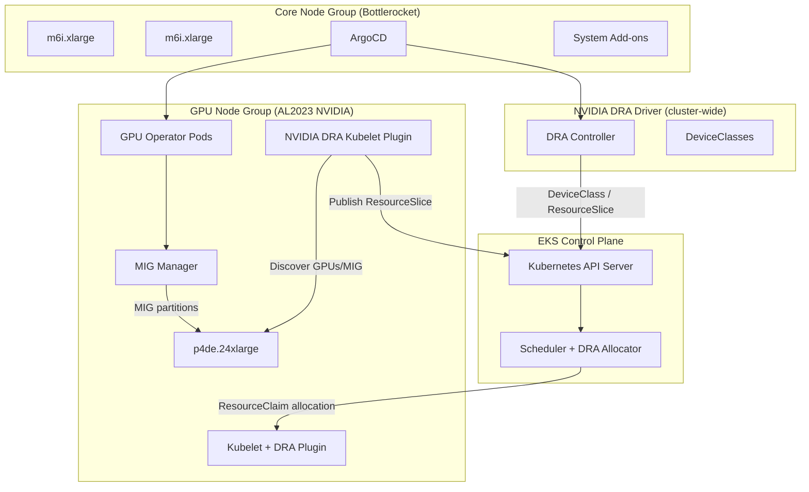
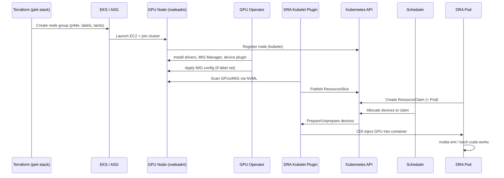
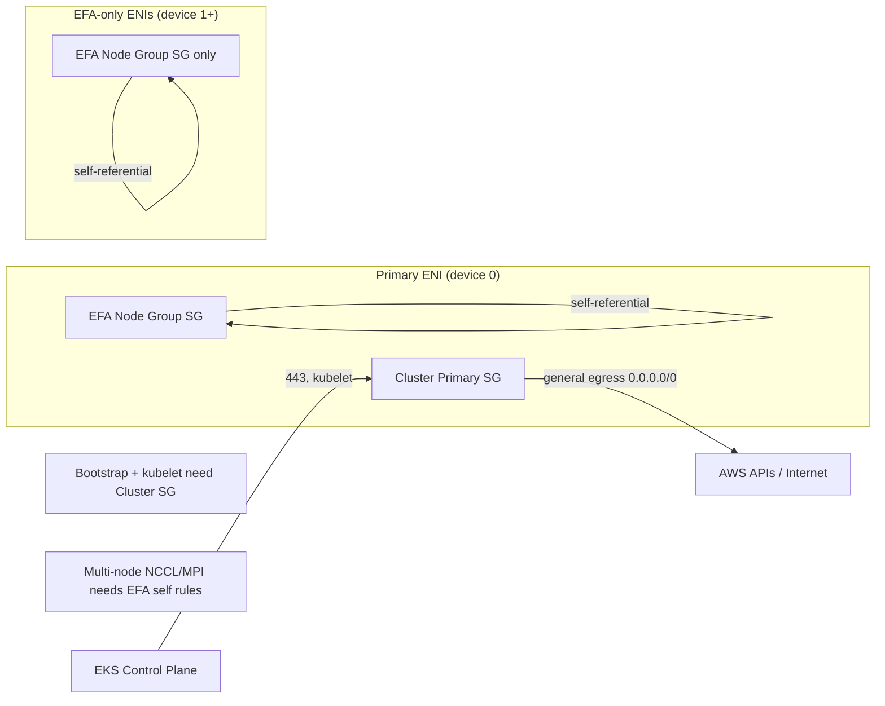
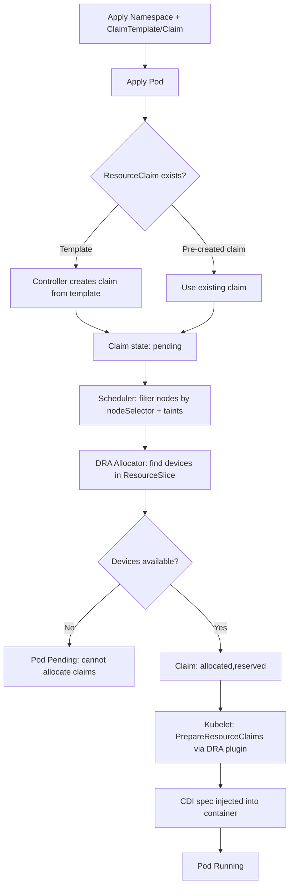
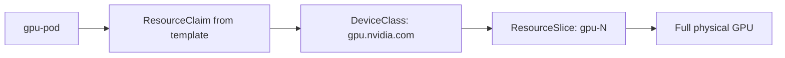
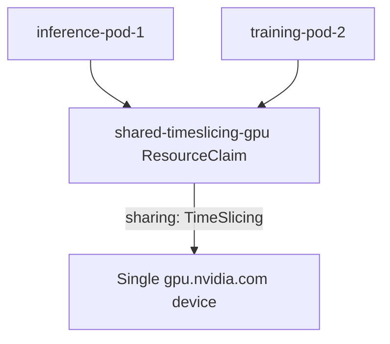
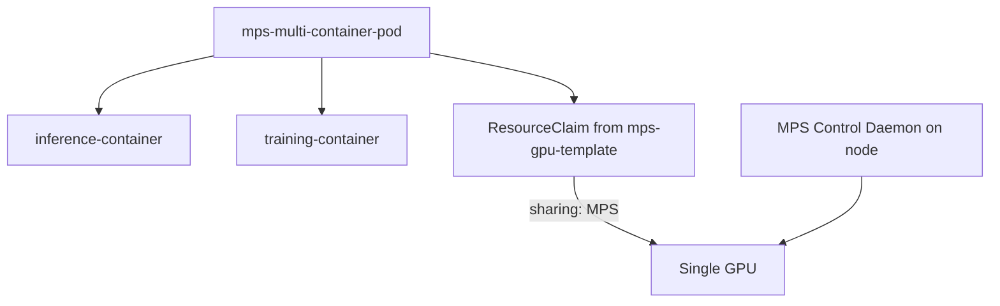
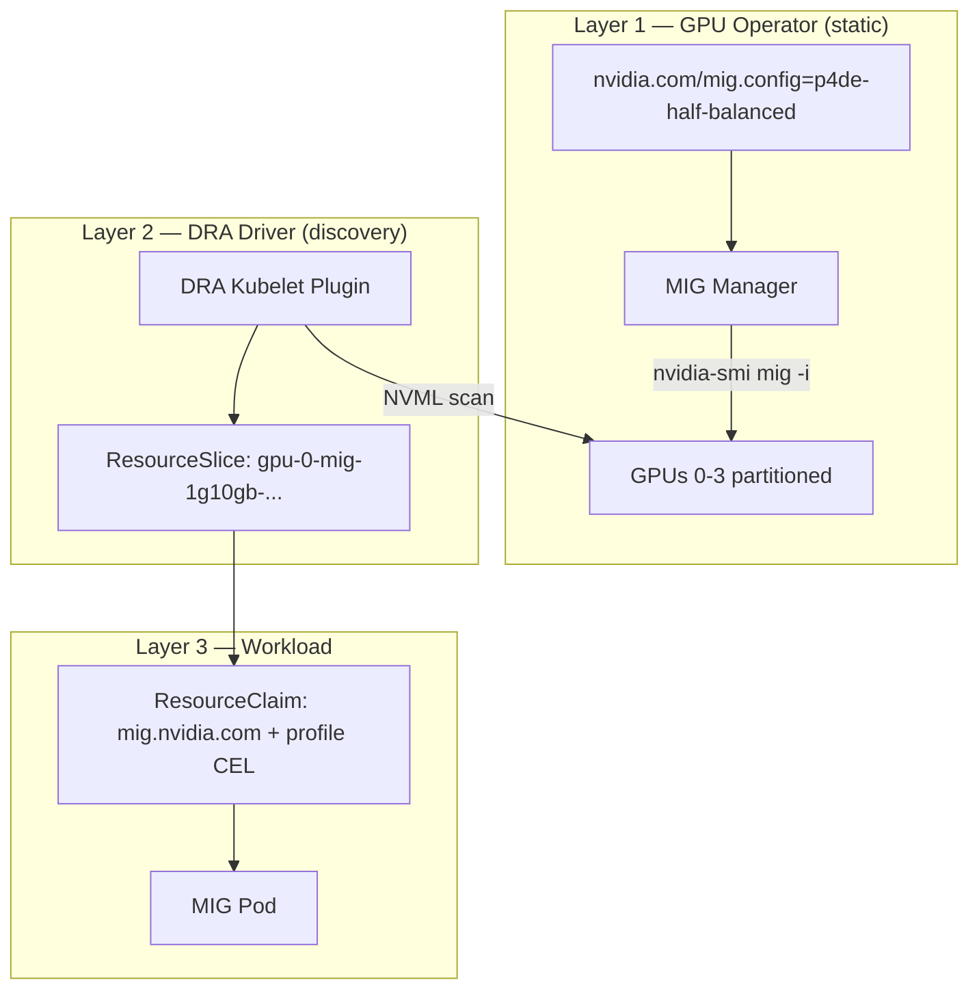
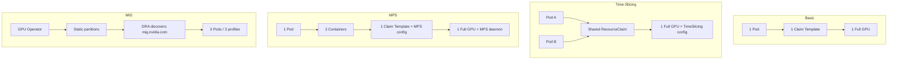

# NVIDIA DRA on JARK Stack — Deployment Guide

This document describes the end-to-end flow for deploying and running **Dynamic Resource Allocation (DRA)** GPU workloads on the **JARK Stack** EKS cluster (`jark-stack`). It covers architecture, components, pod lifecycle, sharing strategies (basic, time-slicing, MPS, MIG), infrastructure prerequisites, changes made during this deployment, and errors encountered with fixes.

---

## Executive Summary

| Topic | Summary |
|-------|---------|
| **What** | Kubernetes DRA (K8s 1.34+) with the **NVIDIA DRA Driver** (`v25.12.0`) for GPU scheduling via `ResourceClaim` / `ResourceClaimTemplate` instead of legacy `nvidia.com/gpu` extended resources |
| **Where** | JARK Stack on EKS (`us-west-2`), GPU node group on `p4de.24xlarge` (A100), core nodes on Bottlerocket |
| **Key components** | EKS, GPU Operator (MIG Manager), NVIDIA DRA Driver (controller + kubelet plugin), DeviceClasses, ResourceSlices |
| **Sharing patterns** | Basic (1:1 GPU), Time-slicing (multi-pod, same GPU), MPS (multi-container, same pod), MIG (hardware partitions on A100) |
| **Main infra fixes** | EFA node groups need `attach_cluster_primary_security_group = true`; MIG needs `nvidia.com/mig.config=p4de-half-balanced` on GPU nodes |
| **Example manifests** | `infra/jark-stack/examples/k8s-dra/{basic,timeslicing,mps,mig}/` |

---

## Table of Contents

1. [Architecture Overview](#architecture-overview)
2. [Components](#components)
3. [Infrastructure Bootstrap Flow](#infrastructure-bootstrap-flow)
4. [DRA Pod Lifecycle Flow](#dra-pod-lifecycle-flow)
5. [Sharing Strategy Flows](#sharing-strategy-flows)
6. [MIG-Specific Flow (Static Partitioning)](#mig-specific-flow-static-partitioning)
7. [Deploy Commands](#deploy-commands)
8. [Verification Checklist](#verification-checklist)
9. [Example Commands and Sample Output](#example-commands-and-sample-output)
10. [Changes Made During Deployment](#changes-made-during-deployment)
11. [Errors Encountered and Fixes](#errors-encountered-and-fixes)
12. [Operational Notes](#operational-notes)

---

## Architecture Overview

### High-Level Stack



### Data Plane: From Terraform to Running Pod



### Network / Security Group Model (EFA GPU Nodes)



---

## Components

### 1. Amazon EKS (JARK Stack)

| Item | Value / Notes |
|------|---------------|
| Cluster | `jark-stack` |
| Kubernetes | 1.34.x |
| DRA | Enabled via cluster feature gates (DRA is GA in supported versions) |
| Node groups | `core-node-group` (Bottlerocket), `nvidia-gpu` (AL2023 NVIDIA AMI) |
| Optional | `cbr` node group when `capacity_block_reservation_id` is set |

**Key Terraform file:** `infra/base/terraform/eks.tf`  
**Deploy path:** copy base → `infra/jark-stack/terraform/_LOCAL/` via `install.sh`, then `terraform apply`.

### 2. NVIDIA GPU Operator

Deployed via ArgoCD from `infra/base/terraform/argocd-addons/nvidia-gpu-operator.yaml`.

| Sub-component | Role |
|---------------|------|
| **Node Feature Discovery (NFD)** | Labels nodes (`nvidia.com/gpu.present`, product, memory, etc.) |
| **GPU Feature Discovery (GFD)** | Exposes GPU attributes |
| **Device Plugin** | Legacy `nvidia.com/gpu` resources (coexists with DRA; DRA examples do not use it) |
| **MIG Manager** | Applies static MIG profiles when `nvidia.com/mig.config` label is set |
| **DCGM Exporter** | GPU metrics (may crash on some nodes; not blocking for DRA) |
| **Validator** | Validates driver/GPU health after MIG changes |

**MIG profile config:** `infra/base/terraform/helm-values/nvidia-gpu-operator.yaml`  
Default MIG config name: `all-disabled`. For MIG examples: **`p4de-half-balanced`** on GPUs 0–3:

```yaml
p4de-half-balanced:
  - devices: [0, 1, 2, 3]
    mig-enabled: true
    mig-devices:
      "1g.10gb": 2
      "2g.20gb": 1
      "3g.40gb": 1
  - devices: [4, 5, 6, 7]
    mig-enabled: false
```

`WITH_REBOOT: true` — changing MIG config **reboots the node**.

### 3. NVIDIA DRA Driver (Helm chart v25.12.0)

**Namespace:** `nvidia-dra-driver-gpu`  
**Values:** `infra/base/terraform/helm-values/nvidia-dra-driver.yaml`

| Component | Runs on | Role |
|-----------|---------|------|
| **Controller** | Core node | Cluster-level DRA driver logic, DeviceClasses |
| **Kubelet plugin** | GPU nodes only | Discovers devices, publishes **ResourceSlice**, prepares CDI specs |

**Feature gates (this deployment):**

```yaml
featureGates:
  TimeSlicingSettings: true   # Time-slicing sharing strategy
  MPSSupport: true            # MPS sharing strategy
  # DynamicMIG: false (default) — JARK uses static MIG via GPU Operator
```

**Important:** `DynamicMIG` and `MPSSupport` are **mutually exclusive** in v25.12.0. JARK MIG examples use **static MIG** (GPU Operator), not DRA DynamicMIG.

**Kubelet plugin scheduling constraints:**

- `nvidia.com/gpu.present=true`
- **Not** Bottlerocket (`system-os_release.ID != bottlerocket`)
- Tolerates `nvidia.com/gpu` taint

### 4. Kubernetes DRA API Objects

| API Kind | Purpose |
|----------|---------|
| **DeviceClass** | Defines selectable device types (`gpu.nvidia.com`, `mig.nvidia.com`) |
| **ResourceSlice** | Node-local inventory published by kubelet plugin (GPUs, MIG slices) |
| **ResourceClaimTemplate** | Template; controller creates a **ResourceClaim** per pod |
| **ResourceClaim** | Requests N devices; scheduler **allocates** specific device IDs |
| **Pod** | References claims via `spec.resourceClaims` + `resources.claims` |

### 5. Device Classes Used in Examples

| DeviceClass | Use case | Selector |
|-------------|----------|----------|
| `gpu.nvidia.com` | Full GPU, time-slicing, MPS | Full physical GPU |
| `mig.nvidia.com` | MIG workloads | `device.attributes['gpu.nvidia.com'].type == 'mig'` + CEL profile |

---

## Infrastructure Bootstrap Flow

### Step 1 — Deploy JARK Stack

```bash
cd infra/jark-stack
./install.sh   # copies infra/base/terraform → terraform/_LOCAL, runs terraform
```

Or targeted EKS update:

```bash
cd infra/jark-stack/terraform/_LOCAL
terraform apply -auto-approve -var-file=../blueprint.tfvars -target=module.eks
```

### Step 2 — Scale GPU Node Group

GPU node groups start at `desired_size = 0` to save cost. Scale up:

```bash
aws eks update-nodegroup-config \
  --cluster-name jark-stack \
  --nodegroup-name <nvidia-gpu-nodegroup-name> \
  --scaling-config minSize=0,maxSize=4,desiredSize=1
```

### Step 3 — Node Join Requirements (p4de + EFA)

For `p4de.24xlarge` with `enable_efa_support = true`:

| Setting | Required | Why |
|---------|----------|-----|
| `enable_efa_support = true` (cluster + node group) | Yes | Exposes EFA interfaces, placement group |
| `attach_cluster_primary_security_group = true` | **Yes** | EFA node group SG alone cannot reach EKS API / AWS APIs |
| `nvidia.com/mig.config = p4de-half-balanced` | Yes for MIG | GPU Operator applies MIG geometry |
| AL2023 NVIDIA AMI | Yes | DRA kubelet plugin excludes Bottlerocket |

### Step 4 — ArgoCD Syncs GPU Stack

Verify:

```bash
kubectl get pods -n gpu-operator
kubectl get pods -n nvidia-dra-driver-gpu
kubectl get deviceclass
```

### Step 5 — Confirm ResourceSlices on GPU Node

```bash
kubectl get nodes -l nvidia.com/gpu.present=true
kubectl get resourceslice -A
```

Expect `gpu.nvidia.com` slice on all GPU nodes; `mig.nvidia.com` devices appear only after MIG Manager partitions the node **and** DRA plugin rescans.

---

## DRA Pod Lifecycle Flow

### Generic Flow (All Examples)



### Pod Spec Pattern

Every DRA pod uses this wiring:

```yaml
spec:
  containers:
  - name: workload
    resources:
      claims:
      - name: my-claim          # logical name in pod
  resourceClaims:
  - name: my-claim
    resourceClaimTemplateName: my-template   # OR resourceClaimName: shared-claim
  nodeSelector:
    nvidia.com/gpu.present: "true"
  tolerations:
  - key: nvidia.com/gpu
    operator: Exists
    effect: NoSchedule
```

### ResourceClaim vs ResourceClaimTemplate

| Pattern | When to use | Example |
|---------|-------------|---------|
| **ResourceClaimTemplate** | One claim **per pod** (isolated allocation) | Basic GPU, MPS, MIG |
| **ResourceClaim** (standalone) | **One claim shared** by multiple pods | Time-slicing (same GPU) |

**Time-slicing lesson learned:** Two pods each with their own template → two claims → **two GPUs required**. On a 1-GPU node the second pod stays Pending. Fix: one pre-created `ResourceClaim` referenced by both pods via `resourceClaimName`.

---

## Sharing Strategy Flows

### 1. Basic GPU Allocation

**Path:** `infra/jark-stack/examples/k8s-dra/basic/`



- **1 pod : 1 claim : 1 full GPU**
- No sharing config in claim
- `nodeSelector: NodeGroupType: g6-mng` (label retained on p4de node group for compatibility)

### 2. Time-Slicing (Multi-Pod, Same GPU)

**Path:** `infra/jark-stack/examples/k8s-dra/timeslicing/`



**Claim config (key part):**

```yaml
spec:
  devices:
    requests:
    - name: shared-gpu
      deviceClassName: gpu.nvidia.com
    config:
    - requests: ["shared-gpu"]
      opaque:
        driver: gpu.nvidia.com
        parameters:
          apiVersion: resource.nvidia.com/v1beta1
          kind: GpuConfig
          sharing:
            strategy: TimeSlicing
```

**Flow:**

1. Apply `timeslicing-claim.yaml` (namespace + shared claim)
2. Apply `timeslicing-pod.yaml` (both pods use `resourceClaimName: shared-timeslicing-gpu`)
3. Scheduler allocates **one** GPU to the shared claim
4. Both pods schedule on the same node; DRA time-slices GPU access

**Verified behavior:** Claim stays `pending` until pods exist; then `allocated,reserved` with both pods in `reservedFor`.

### 3. MPS (Multi-Container, Same Pod)

**Path:** `infra/jark-stack/examples/k8s-dra/mps/`



- **1 pod, 2 containers, 1 claim, 1 GPU**
- Sharing strategy: `MPS` (CUDA Multi-Process Service)
- MPS control daemon pod appears on the GPU node when MPS claim is active
- Containers see `CUDA_MPS_PIPE_DIRECTORY`; `nvidia-smi` shows `M+C` compute mode

### 4. MIG (Hardware Partitions)

See [MIG-Specific Flow](#mig-specific-flow-static-partitioning) below.

### Strategy Comparison

| Strategy | Isolation | Granularity | Hardware | Best for |
|----------|-----------|-------------|----------|----------|
| Basic | Full GPU | 1 GPU | Any NVIDIA GPU | Max performance, full VRAM |
| Time-slicing | Software (time multiplex) | Full GPU shared | g6/L4, p4de | Many light jobs, bursty inference |
| MPS | Software (SM sharing) | Full GPU shared | g6/L4, p4de | Multiple CUDA processes, same pod |
| MIG | Hardware partitions | Fixed profiles (1g/2g/3g) | A100/H100 only | Strong isolation, predictable VRAM |

---

## MIG-Specific Flow (Static Partitioning)

### Architecture: Two-Layer MIG



**Do not enable `DynamicMIG`** on the DRA driver for this pattern. DRA **discovers** slices created by GPU Operator; it does not create MIG geometry.

### MIG Pod Flow (Step by Step)

1. **Node provisioned** with label `nvidia.com/mig.config=p4de-half-balanced`
2. **MIG Manager** detects label change → applies profile → **reboots node** (`WITH_REBOOT=true`)
3. After reboot, GPUs 0–3 have MIG instances: 2× `1g.10gb`, 1× `2g.20gb`, 1× `3g.40gb` each
4. **DRA kubelet plugin** scans node → publishes MIG devices in ResourceSlice
   - If plugin started **before** MIG finished: logs `MIG mode enabled but no configured MIG devices` → **restart plugin**
5. Apply **`mig-claim-template.yaml`** (3 templates for 3g/2g/1g profiles)
6. Apply **`mig-pod.yaml`** (3 pods, each with own template)
7. Scheduler allocates matching MIG slice per claim
8. Pods run with ~10 GB / ~21 GB / ~42 GB VRAM respectively

### MIG Claim Example

```yaml
deviceClassName: mig.nvidia.com
selectors:
- cel:
    expression: device.attributes['gpu.nvidia.com'].profile == '1g.10gb'
```

### Verified Allocation (example run)

| Pod | Profile | Allocated device |
|-----|---------|------------------|
| `mig-small-inference-pod` | `1g.10gb` | `gpu-3-mig-1g10gb-19-3` |
| `mig-medium-training-pod` | `2g.20gb` | `gpu-0-mig-2g20gb-14-0` |
| `mig-large-training-pod` | `3g.40gb` | `gpu-2-mig-3g40gb-9-4` |

---

## Deploy Commands

### Basic

```bash
kubectl apply -f infra/jark-stack/examples/k8s-dra/basic/basic-gpu-claim-template.yaml
kubectl apply -f infra/jark-stack/examples/k8s-dra/basic/basic-gpu-pod.yaml
```

### Time-Slicing

```bash
kubectl apply -f infra/jark-stack/examples/k8s-dra/timeslicing/timeslicing-claim.yaml
kubectl apply -f infra/jark-stack/examples/k8s-dra/timeslicing/timeslicing-pod.yaml
```

### MPS

```bash
kubectl apply -f infra/jark-stack/examples/k8s-dra/mps/mps-claim-template.yaml
kubectl apply -f infra/jark-stack/examples/k8s-dra/mps/mps-pod.yaml
```

### MIG

```bash
# Ensure node has nvidia.com/mig.config=p4de-half-balanced and MIG Manager finished
kubectl apply -f infra/jark-stack/examples/k8s-dra/mig/mig-claim-template.yaml
kubectl apply -f infra/jark-stack/examples/k8s-dra/mig/mig-pod.yaml

# After MIG config change, restart DRA plugin on that node:
kubectl delete pod -n nvidia-dra-driver-gpu -l app=nvidia-dra-driver-gpu-kubelet-plugin \
  --field-selector spec.nodeName=<gpu-node-name>
```

---

## Verification Checklist

### Cluster / Infra

```bash
kubectl get nodes -o wide
kubectl get nodes -l nvidia.com/gpu.present=true \
  -o custom-columns=NAME:.metadata.name,INSTANCE:.metadata.labels.node\\.kubernetes\\.io/instance-type,MIG:.metadata.labels.nvidia\\.com/mig\\.config
kubectl get pods -n gpu-operator
kubectl get pods -n nvidia-dra-driver-gpu
kubectl get deviceclass
kubectl get resourceslice -A
```

### DRA Workloads

```bash
kubectl get resourceclaim -A
kubectl get pods -A | grep -E 'mig-|timeslicing|mps-|gpu-pod'
kubectl describe resourceclaim -n <namespace> <claim-name>
```

### In-Pod GPU Check

```bash
kubectl exec -n mig-gpu mig-small-inference-pod -- \
  python -c "import torch; print(torch.cuda.get_device_name(0))"
```

---

## Example Commands and Sample Output

This section lists **copy-paste commands** used during the deployment and **representative output** from cluster `jark-stack`. Replace node names, claim names, and AWS profile/region as needed.

### Setup — AWS and kubectl

```bash
export AWS_PROFILE=ml-aws
export AWS_REGION=us-west-2

# Configure kubectl for the cluster
aws eks update-kubeconfig --name jark-stack --region us-west-2

# Find GPU node group name (changes after recreate)
aws eks list-nodegroups --cluster-name jark-stack --output table
```

**Example output:**

```
-----------------------------------------------------------------------
|                          ListNodegroups                             |
+---------------------------------------------------------------------+
||                          nodegroups                               ||
|+-------------------------------------------------------------------+|
||  core-node-group-20260525144732101900000008                       ||
||  nvidia-gpu-20260526145141862200000003                            ||
|+-------------------------------------------------------------------+|
```

```bash
# Scale GPU node group to 1 instance
aws eks update-nodegroup-config \
  --cluster-name jark-stack \
  --nodegroup-name nvidia-gpu-20260526145141862200000003 \
  --scaling-config minSize=0,maxSize=4,desiredSize=1
```

**Example output:**

```json
{
    "update": {
        "id": "...",
        "status": "InProgress",
        "type": "ConfigUpdate",
        "params": [
            {
                "type": "MinSize",
                "value": "0"
            },
            {
                "type": "MaxSize",
                "value": "4"
            },
            {
                "type": "DesiredSize",
                "value": "1"
            }
        ]
    }
}
```

```bash
# Describe node group (instance type, AMI, health)
aws eks describe-nodegroup \
  --cluster-name jark-stack \
  --nodegroup-name nvidia-gpu-20260526145141862200000003 \
  --query 'nodegroup.{status:status,amiType:amiType,instanceTypes:instanceTypes,scaling:scalingConfig,health:health}' \
  --output json
```

**Example output:**

```json
{
    "status": "ACTIVE",
    "amiType": "AL2023_x86_64_NVIDIA",
    "instanceTypes": ["p4de.24xlarge"],
    "scaling": {
        "minSize": 0,
        "maxSize": 4,
        "desiredSize": 1
    },
    "health": {
        "issues": []
    }
}
```

---

### Infrastructure — Nodes and EC2

```bash
kubectl get nodes -o wide
```

**Example output (healthy cluster with 1 GPU node):**

```
NAME                                           STATUS   ROLES    AGE   VERSION               INTERNAL-IP      OS-IMAGE
ip-100-64-210-123.us-west-2.compute.internal   Ready    <none>   24h   v1.34.4-eks-f69f56f   100.64.210.123   Bottlerocket OS 1.61.0 (aws-k8s-1.34)
ip-100-64-35-204.us-west-2.compute.internal    Ready    <none>   10m   v1.34.8-eks-3385e9b   100.64.35.204    Amazon Linux 2023.11.20260514
ip-100-64-79-114.us-west-2.compute.internal    Ready    <none>   24h   v1.34.4-eks-f69f56f   100.64.79.114    Bottlerocket OS 1.61.0 (aws-k8s-1.34)
```

```bash
kubectl get nodes -l nvidia.com/gpu.present=true \
  -o custom-columns=NAME:.metadata.name,INSTANCE:.metadata.labels.node\\.kubernetes\\.io/instance-type,MIG:.metadata.labels.nvidia\\.com/mig\\.config,STATE:.metadata.labels.nvidia\\.com/mig\\.config\\.state
```

**Example output (MIG enabled):**

```
NAME                                          INSTANCE        MIG                  STATE
ip-100-64-35-204.us-west-2.compute.internal   p4de.24xlarge   p4de-half-balanced   success
```

**Example output (MIG NOT configured — pods will fail):**

```
NAME                                          INSTANCE        MIG            STATE
ip-100-64-35-204.us-west-2.compute.internal   p4de.24xlarge   all-disabled   success
```

```bash
# Apply MIG config label manually (if not set by Terraform yet)
kubectl label node ip-100-64-35-204.us-west-2.compute.internal \
  nvidia.com/mig.config=p4de-half-balanced --overwrite
```

**Example output:**

```
node/ip-100-64-35-204.us-west-2.compute.internal labeled
```

```bash
# Debug: EC2 instance vs Kubernetes node (when node won't join)
aws ec2 describe-instances \
  --filters "Name=tag:eks:cluster-name,Values=jark-stack" "Name=instance-state-name,Values=running" \
  --query 'Reservations[].Instances[].{Id:InstanceId,Type:InstanceType,PrivateIp:PrivateIpAddress,Nodegroup:Tags[?Key==`eks:nodegroup-name`].Value|[0]}' \
  --output table
```

**Example output:**

```
------------------------------------------------------------------------------------------------------------------
|                                               DescribeInstances                                                |
+---------------------+----------------------------------------------+-----------------+-------------------------+
|         Id          |                  Nodegroup                   |    PrivateIp    |          Type           |
+---------------------+----------------------------------------------+-----------------+-------------------------+
|  i-0f7d85d410d7d6c55|  core-node-group-20260525144732101900000008  |  100.64.79.114  |  m6i.xlarge             |
|  i-03db85e12143de7ba|  nvidia-gpu-20260526145141862200000003       |  100.64.35.204  |  p4de.24xlarge          |
|  i-08a153b2f4a2392d1|  core-node-group-20260525144732101900000008  |  100.64.210.123 |  m6i.xlarge             |
+---------------------+----------------------------------------------+-----------------+-------------------------+
```

```bash
# Console output when nodeadm is stuck (EFA SG issue — before fix)
aws ec2 get-console-output --instance-id i-03db85e12143de7ba --latest --output text | tail -15
```

**Example output (failure):**

```
[   13.262500] nodeadm[24172]: info init/init.go:171 Fetching instance details..
[   43.453180] nodeadm[24172]: SDK 2026/05/26 14:57:57 DEBUG retrying request EC2/DescribeInstances, attempt 2
[  107.440071] nodeadm[24172]: SDK 2026/05/26 14:59:01 DEBUG retrying request EC2/DescribeInstances, attempt 4
[  252.641967] nodeadm[24172]: SDK 2026/05/26 15:01:27 DEBUG retrying request EC2/DescribeInstances, attempt 7
```

---

### GPU Operator and DRA Driver

```bash
kubectl get pods -n gpu-operator -o wide
kubectl get pods -n nvidia-dra-driver-gpu -o wide
```

**Example output:**

```
# gpu-operator (on GPU node)
NAME                                         READY   STATUS      RESTARTS   AGE   NODE
nvidia-device-plugin-daemonset-dxnms         1/1     Running     0          3m    ip-100-64-35-204...
nvidia-mig-manager-8zhwq                     1/1     Running     1          2m    ip-100-64-35-204...
nvidia-operator-validator-5gxct              1/1     Running     0          3m    ip-100-64-35-204...

# nvidia-dra-driver-gpu
NAME                                                READY   STATUS    RESTARTS   AGE   NODE
nvidia-dra-driver-gpu-controller-7d7c7dbc67-7mbtj   1/1     Running   0          5h    ip-100-64-79-114...
nvidia-dra-driver-gpu-kubelet-plugin-xzvrn          2/2     Running   2          8m    ip-100-64-35-204...
```

```bash
kubectl get deviceclass
```

**Example output:**

```
NAME                  AGE
gpu.nvidia.com        24h
mig.nvidia.com        24h
compute-domain.nvidia.com   24h
```

```bash
kubectl get resourceslice -A
```

**Example output (full GPU only — before MIG partition):**

```
NAME                                                              NODE                                          DRIVER           AGE
ip-100-64-35-204.us-west-2.compute.internal-gpu.nvidia.comj72zg   ip-100-64-35-204.us-west-2.compute.internal   gpu.nvidia.com   103s
```

```bash
# List MIG devices inside ResourceSlice (after MIG + DRA plugin restart)
kubectl get resourceslice -A -o yaml | grep -E 'name: gpu|profile'
```

**Example output (MIG devices advertised):**

```
      name: gpu-4
      name: gpu-5
      name: gpu-6
      name: gpu-7
        profile:
      name: gpu-0-mig-2g20gb-14-0
        profile:
      name: gpu-2-mig-3g40gb-9-4
        profile:
      name: gpu-3-mig-1g10gb-19-3
        profile:
      name: gpu-0-mig-1g10gb-19-2
        profile:
      name: gpu-0-mig-1g10gb-19-3
        profile:
      name: gpu-0-mig-3g40gb-9-4
```

```bash
# MIG Manager logs — applying profile
kubectl logs -n gpu-operator -l app=nvidia-mig-manager --tail=10
```

**Example output:**

```
time="2026-05-26T15:22:08Z" level=info msg="Successfully updated to MIG config: p4de-half-balanced"
time="2026-05-26T15:22:08Z" level=info msg="Waiting for change to 'nvidia.com/mig.config' label"
```

```bash
# DRA plugin logs — MIG not ready yet (restart plugin after MIG success)
kubectl logs -n nvidia-dra-driver-gpu -l app=nvidia-dra-driver-gpu-kubelet-plugin --tail=30 | grep -E 'MIG|Adding device|gpu-'
```

**Example output (problem — scan before MIG slices exist):**

```
W0526 15:21:36.530502 Physical GPU gpu-0 has MIG mode enabled but no configured MIG devices
W0526 15:21:36.550156 Physical GPU gpu-1 has MIG mode enabled but no configured MIG devices
I0526 15:21:36.616235 Adding device gpu-4 to allocatable devices
I0526 15:21:36.637627 Adding device gpu-5 to allocatable devices
```

```bash
# Restart DRA kubelet plugin on a specific GPU node
kubectl delete pod -n nvidia-dra-driver-gpu \
  -l app=nvidia-dra-driver-gpu-kubelet-plugin \
  --field-selector spec.nodeName=ip-100-64-35-204.us-west-2.compute.internal
```

---

### Time-Slicing Example

```bash
kubectl apply -f infra/jark-stack/examples/k8s-dra/timeslicing/timeslicing-claim.yaml
kubectl apply -f infra/jark-stack/examples/k8s-dra/timeslicing/timeslicing-pod.yaml

kubectl get resourceclaim,pods -n timeslicing-gpu -o wide
kubectl describe resourceclaim -n timeslicing-gpu shared-timeslicing-gpu
```

**Example output (success — both pods share one claim):**

```
NAME                                                    STATE                AGE
resourceclaim.resource.k8s.io/shared-timeslicing-gpu    allocated,reserved   2m

NAME                READY   STATUS    RESTARTS   AGE   IP             NODE
inference-pod-1     1/1     Running   0          2m    100.64.x.x     ip-100-64-35-204...
training-pod-2      1/1     Running   0          2m    100.64.x.x     ip-100-64-35-204...
```

```bash
# Verify both pods reserved the same claim
kubectl get resourceclaim -n timeslicing-gpu shared-timeslicing-gpu \
  -o jsonpath='{.status.reservedFor}{"\n"}{.status.allocation.devices.results[0].device}{"\n"}'
```

**Example output:**

```
[{"resource":"pods","name":"inference-pod-1","uid":"..."},{"resource":"pods","name":"training-pod-2","uid":"..."}]
gpu-0
```

**Example output (failure — per-pod templates, 2 claims on 1 GPU node):**

```
$ kubectl describe pod -n timeslicing-gpu training-pod-2 | tail -5
Events:
  Warning  FailedScheduling  default-scheduler  0/3 nodes are available: 1 cannot allocate all claims, 2 node(s) didn't match Pod's node affinity/selector.
```

---

### MPS Example

```bash
kubectl apply -f infra/jark-stack/examples/k8s-dra/mps/mps-claim-template.yaml
kubectl apply -f infra/jark-stack/examples/k8s-dra/mps/mps-pod.yaml

kubectl get pods -n mps-gpu -o wide
kubectl get resourceclaim -n mps-gpu
```

**Example output:**

```
NAME                        READY   STATUS    RESTARTS   AGE   NODE
mps-multi-container-pod     2/2     Running   0          1m    ip-100-64-35-204...

NAME                                                    STATE                AGE
resourceclaim.resource.k8s.io/mps-multi-container-pod-mps-gpu-template-xxxxx   allocated,reserved   1m
```

```bash
# Check MPS control daemon on GPU node
kubectl get pods -A | grep -i mps

# Verify sharing strategy on claim
kubectl get resourceclaim -n mps-gpu -o yaml | grep -A5 'strategy:'
```

**Example output:**

```
sharing:
  strategy: MPS
```

```bash
# Inside a container — MPS pipe directory
kubectl exec -n mps-gpu mps-multi-container-pod -c inference-container -- env | grep MPS
kubectl exec -n mps-gpu mps-multi-container-pod -c inference-container -- nvidia-smi
```

**Example output (compute mode M+C = MPS):**

```
CUDA_MPS_PIPE_DIRECTORY=/tmp/nvidia-mps
...
| Compute Mode                       | M+C                           |
```

---

### MIG Example

```bash
# 1. Ensure MIG label on node
kubectl get node -l nvidia.com/gpu.present=true -L nvidia.com/mig.config,nvidia.com/mig.config.state

# 2. Apply manifests
kubectl apply -f infra/jark-stack/examples/k8s-dra/mig/mig-claim-template.yaml
kubectl apply -f infra/jark-stack/examples/k8s-dra/mig/mig-pod.yaml

# 3. Watch until Running
kubectl get pods,resourceclaim -n mig-gpu -w
```

**Example output (failure — MIG disabled on node):**

```
NAME                          READY   STATUS    RESTARTS   AGE
pod/mig-large-training-pod    0/1     Pending   0          16s
pod/mig-medium-training-pod   0/1     Pending   0          15s
pod/mig-small-inference-pod   0/1     Pending   0          15s

NAME                                                                           STATE     AGE
resourceclaim.resource.k8s.io/mig-small-inference-pod-mig-small-claim-x2vzn    pending   16s
```

```bash
kubectl describe pod -n mig-gpu mig-small-inference-pod | tail -8
```

**Example output:**

```
Events:
  Warning  FailedScheduling  default-scheduler  0/3 nodes are available: 1 cannot allocate all claims, 2 node(s) didn't match Pod's node affinity/selector.
  Warning  FailedScheduling  karpenter          Failed to schedule pod, pod has Dynamic Resource Allocation requirements that are not yet supported by Karpenter
```

**Example output (success — after MIG label + DRA plugin restart):**

```
NAME                          READY   STATUS    RESTARTS   AGE
pod/mig-large-training-pod    1/1     Running   0          9m
pod/mig-medium-training-pod   1/1     Running   0          9m
pod/mig-small-inference-pod   1/1     Running   0          9m

NAME                                                                           STATE                AGE
resourceclaim.resource.k8s.io/mig-large-training-pod-mig-large-claim-tqz4q     allocated,reserved   9m
resourceclaim.resource.k8s.io/mig-medium-training-pod-mig-medium-claim-t68kr   allocated,reserved   9m
resourceclaim.resource.k8s.io/mig-small-inference-pod-mig-small-claim-x2vzn    allocated,reserved   9m
```

```bash
# Which MIG slice each claim received
kubectl get resourceclaim -n mig-gpu \
  -o custom-columns=CLAIM:.metadata.name,DEVICE:.status.allocation.devices.results[0].device
```

**Example output:**

```
CLAIM                                                    DEVICE
mig-large-training-pod-mig-large-claim-tqz4q             gpu-2-mig-3g40gb-9-4
mig-medium-training-pod-mig-medium-claim-t68kr           gpu-0-mig-2g20gb-14-0
mig-small-inference-pod-mig-small-claim-x2vzn          gpu-3-mig-1g10gb-19-3
```

```bash
# Verify CUDA inside each pod
kubectl exec -n mig-gpu mig-small-inference-pod -- \
  python -c "import torch; d=torch.cuda.get_device_name(0); m=torch.cuda.get_device_properties(0).total_memory/1e9; print(d, f'{m:.1f}GB')"

kubectl exec -n mig-gpu mig-medium-training-pod -- \
  python -c "import torch; d=torch.cuda.get_device_name(0); m=torch.cuda.get_device_properties(0).total_memory/1e9; print(d, f'{m:.1f}GB')"

kubectl exec -n mig-gpu mig-large-training-pod -- \
  python -c "import torch; d=torch.cuda.get_device_name(0); m=torch.cuda.get_device_properties(0).total_memory/1e9; print(d, f'{m:.1f}GB')"
```

**Example output:**

```
NVIDIA A100-SXM4-80GB MIG 1g.10gb 10.2GB
NVIDIA A100-SXM4-80GB MIG 2g.20gb 20.9GB
NVIDIA A100-SXM4-80GB MIG 3g.40gb 42.1GB
```

---

### Basic GPU Example

```bash
kubectl apply -f infra/jark-stack/examples/k8s-dra/basic/basic-gpu-claim-template.yaml
kubectl apply -f infra/jark-stack/examples/k8s-dra/basic/basic-gpu-pod.yaml

kubectl get pods -n gpu-test1
kubectl exec -n gpu-test1 gpu-pod -- nvidia-smi -L
```

**Example output:**

```
NAME      READY   STATUS    RESTARTS   AGE
gpu-pod   1/1     Running   0          30s

GPU 0: NVIDIA A100-SXM4-80GB (UUID: GPU-...)
```

---

### Debugging — General DRA Troubleshooting

```bash
# All claims cluster-wide
kubectl get resourceclaim -A \
  -o custom-columns=NAMESPACE:.metadata.namespace,NAME:.metadata.name,STATE:.status.allocation,CLASS:.spec.devices.requests[0].deviceClassName

# Pod scheduling events
kubectl describe pod -n <namespace> <pod-name> | grep -A20 Events:

# DRA plugin on all GPU nodes
kubectl get pods -n nvidia-dra-driver-gpu -l app=nvidia-dra-driver-gpu-kubelet-plugin -o wide

# Security groups on GPU instance (EFA debugging)
INSTANCE_ID=$(aws ec2 describe-instances \
  --filters "Name=tag:eks:nodegroup-name,Values=nvidia-gpu-20260526145141862200000003" \
            "Name=instance-state-name,Values=running" \
  --query 'Reservations[0].Instances[0].InstanceId' --output text)

aws ec2 describe-instances --instance-ids $INSTANCE_ID \
  --query 'Reservations[0].Instances[0].NetworkInterfaces[*].{Idx:Attachment.DeviceIndex,Type:InterfaceType,Groups:Groups[*].GroupId}' \
  --output table
```

**Example output (correct — primary ENI has cluster SG + EFA SG):**

```
|  DescribeInstances  |
+--------+-----------------+
|   Idx  |      Type       |
+--------+-----------------+
|  0     |  efa            |
||  sg-0f8e8a1d4f5daca41  ||   # cluster primary SG
||  sg-0f6a5bc585ea812b7  ||   # EFA node group SG
|  1     |  efa-only       |
||  sg-0f6a5bc585ea812b7  ||   # EFA only
```

```bash
# Clean up an example namespace
kubectl delete -f infra/jark-stack/examples/k8s-dra/mig/mig-pod.yaml
kubectl delete -f infra/jark-stack/examples/k8s-dra/mig/mig-claim-template.yaml
# Claims from templates are garbage-collected when pods are deleted
```

---

### Terraform Apply (JARK Stack)

```bash
# Copy latest base terraform into _LOCAL
cp -r infra/base/terraform/* infra/jark-stack/terraform/_LOCAL/

cd infra/jark-stack/terraform/_LOCAL
terraform init
terraform plan -var-file=../blueprint.tfvars -target=module.eks
terraform apply -auto-approve -var-file=../blueprint.tfvars -target=module.eks
```

**Tip:** After changing node group launch template (EFA + cluster SG, MIG labels), terminate old GPU instances or roll the ASG so new nodes pick up the template.

---

## Changes Made During Deployment

### Terraform — `infra/base/terraform/eks.tf`

| Change | Before | After | Reason |
|--------|--------|-------|--------|
| GPU instance type | `g6.4xlarge` | `p4de.24xlarge` | MIG requires A100 |
| `enable_efa_support` (cluster) | not set | `true` | Required by EKS module for EFA node groups |
| `attach_cluster_primary_security_group` | not set | `true` on GPU groups | Node bootstrap + kubelet registration |
| `nvidia.com/mig.config` label | missing on `nvidia-gpu` | `p4de-half-balanced` | GPU Operator MIG partitioning |
| `max_size` (nvidia-gpu) | `1` | `4` | Allow multi-node EFA scaling |
| `vpc.amazonaws.com/efa.present` label | missing | `true` | EFA-aware scheduling |
| Custom `security_group_egress_rules` | added then **removed** | removed | Redundant once cluster SG attached |

### Helm — `infra/base/terraform/helm-values/nvidia-dra-driver.yaml`

| Change | Reason |
|--------|--------|
| Documented `TimeSlicingSettings: true`, `MPSSupport: true` | Enable time-slicing and MPS examples |
| Documented **not** to enable `DynamicMIG` | JARK uses static MIG via GPU Operator |

### Examples — `infra/jark-stack/examples/k8s-dra/`

| File | Change |
|------|--------|
| `timeslicing/timeslicing-claim.yaml` | **New** — shared `ResourceClaim` for multi-pod time-slicing |
| `timeslicing/timeslicing-pod.yaml` | Uses `resourceClaimName` instead of per-pod templates |
| `mig/mig-pod.yaml` | Added `nvidia.com/mig.config: p4de-half-balanced` nodeSelector |
| `mig/mig-claim-template.yaml` | Comments clarifying static MIG pattern |

### Docs — `website/docs/guidance/dynamic-resource-allocation.md`

| Change |
|--------|
| Static MIG section (GPU Operator + DRA discovery, no DynamicMIG) |
| MPS verification section with example output |
| Time-slicing shared-claim pattern documented |

---

## Errors Encountered and Fixes

### 1. GPU Node Not Appearing in `kubectl get nodes`

| | |
|---|---|
| **Symptom** | EC2 `p4de` running, ASG InService, but no Kubernetes node |
| **Cause** | EFA node group SG had **only** self-referential egress (no `0.0.0.0/0`, no cluster SG) |
| **Evidence** | Console log: `nodeadm` stuck retrying `EC2/DescribeInstances` |
| **Fix** | `attach_cluster_primary_security_group = true`; attach cluster SG to primary ENI on live instance |
| **Note** | Custom egress rule on EFA SG was a temporary workaround; **not needed** once cluster SG is attached |

### 2. Kubelet Running but Node Still Not Registered

| | |
|---|---|
| **Symptom** | `nodeadm` completed, kubelet running, still no node in API |
| **Cause** | Instance had **only** EFA node group SG — control plane could not reach kubelet |
| **Fix** | Same as above — cluster primary SG on primary ENI |

### 3. Karpenter IAM Policy Size Limit (earlier in session)

| | |
|---|---|
| **Symptom** | Terraform apply failure for Karpenter IAM |
| **Fix** | `enable_inline_policy = true` in `karpenter.tf` |

### 4. `g6.4xlarge` EFA Not Supported

| | |
|---|---|
| **Symptom** | Node group launch failures with EFA enabled |
| **Fix** | `enable_efa_support = false` for g6; only enable for p4/p5 |

### 5. Time-Slicing — Second Pod Pending

| | |
|---|---|
| **Symptom** | `0/3 nodes available: 1 cannot allocate all claims` — second pod never schedules |
| **Cause** | Each pod used `ResourceClaimTemplate` → **2 claims → 2 GPUs** on a 1-GPU node |
| **Fix** | Single pre-created `ResourceClaim` + both pods use `resourceClaimName: shared-timeslicing-gpu` |

### 6. PodGroup API Not Available (EKS 1.34)

| | |
|---|---|
| **Symptom** | `no matches for kind "PodGroup"` |
| **Cause** | PodGroup not installed on cluster |
| **Fix** | Use shared `ResourceClaim` pattern instead of PodGroup for time-slicing |

### 7. MIG Pods Pending — No MIG Devices

| | |
|---|---|
| **Symptom** | Claims `pending`; scheduler: `cannot allocate all claims` |
| **Cause 1** | Node label `nvidia.com/mig.config=all-disabled` (GPU Operator default) |
| **Cause 2** | DRA plugin scanned node before MIG partitions existed |
| **Evidence** | DRA logs: `Physical GPU gpu-0 has MIG mode enabled but no configured MIG devices` |
| **Fix 1** | Set `nvidia.com/mig.config=p4de-half-balanced` on node / node group |
| **Fix 2** | Restart DRA kubelet plugin after MIG Manager finishes (node reboot) |

### 8. MIG Manager Reboot Loop

| | |
|---|---|
| **Symptom** | Node `NotReady` during MIG apply |
| **Expected** | `WITH_REBOOT=true` in MIG Manager — node reboots when profile changes |
| **Action** | Wait for `nvidia.com/mig.config.state=success`, then restart DRA plugin |

### 9. DRA Kubelet Plugin Not on Bottlerocket

| | |
|---|---|
| **Symptom** | No ResourceSlice on core nodes (expected) |
| **Design** | Plugin affinity excludes Bottlerocket — GPU nodes must use **AL2023 NVIDIA AMI** |

### 10. Karpenter Cannot Schedule DRA Pods

| | |
|---|---|
| **Symptom** | `Failed to schedule pod, pod has Dynamic Resource Allocation requirements that are not yet supported by Karpenter` |
| **Impact** | Warning only if a GPU node exists; scheduler assigns to managed node group |
| **Fix** | Use static GPU managed node group for DRA examples; do not rely on Karpenter for DRA pods |

---

## Operational Notes

### Cost

- `p4de.24xlarge` is expensive (~$32/hr on-demand). Scale GPU node group to `desired_size=0` when not testing.
- Capacity Block (`cbr` node group) is optional; standard on-demand `p4de` worked in `us-west-2a` for this deployment.

### Node Labels Reference

| Label | Used by |
|-------|---------|
| `nvidia.com/gpu.present=true` | DRA plugin, all GPU examples |
| `NodeGroupType=g6-mng` | Basic, time-slicing, MPS examples (historical name) |
| `node.kubernetes.io/instance-type=p4de.24xlarge` | MIG examples |
| `nvidia.com/mig.config=p4de-half-balanced` | MIG Manager + MIG pod nodeSelector |
| `vpc.amazonaws.com/efa.present=true` | Multi-node EFA workloads |

### Taints

GPU node group uses:

```yaml
nvidia.com/gpu=true:NoSchedule
```

All examples include matching toleration.

### When to Restart DRA Kubelet Plugin

- After MIG config change / node reboot
- If ResourceSlice shows full GPUs but no MIG devices after MIG Manager success
- After driver upgrade

```bash
kubectl delete pod -n nvidia-dra-driver-gpu \
  -l app=nvidia-dra-driver-gpu-kubelet-plugin \
  --field-selector spec.nodeName=<node>
```

### Related Files

| Path | Description |
|------|-------------|
| `infra/jark-stack/examples/k8s-dra/` | All DRA example manifests |
| `infra/base/terraform/eks.tf` | EKS node groups, EFA, MIG labels |
| `infra/base/terraform/helm-values/nvidia-dra-driver.yaml` | DRA driver feature gates |
| `infra/base/terraform/helm-values/nvidia-gpu-operator.yaml` | MIG profiles |
| `website/docs/guidance/dynamic-resource-allocation.md` | Published user documentation |

---

## Quick Reference Diagram — All Four Patterns



---

*Document generated from the JARK Stack DRA deployment session on cluster `jark-stack` (EKS 1.34, NVIDIA DRA Driver v25.12.0, GPU Operator with MIG Manager).*
