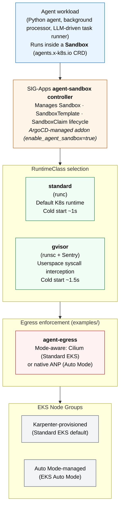

# Agent Sandbox on EKS

The Agent Sandbox on EKS solution deploys a secure, FQDN-filtered Kubernetes environment for running isolated AI agent workloads. It combines kernel-level isolation (gVisor syscall interception), CRD-driven sandbox lifecycle management (the kubernetes-sigs [agent-sandbox](https://github.com/kubernetes-sigs/agent-sandbox) project), and composable egress enforcement (chained Cilium FQDN filtering today, EKS-native `ApplicationNetworkPolicy` on Auto Mode).

## Why?

Agents that execute model-generated code need two guarantees the default Kubernetes pod doesn't provide:

- **Kernel boundary isolation.** Untrusted code running inside the sandbox must not have access to the host kernel's full syscall surface. gVisor's Sentry intercepts syscalls in userspace and serves a restricted subset; Kata+Firecracker (documented as a future tier) adds hardware-virtualization boundaries.
- **Egress policy enforcement.** Agents call LLM APIs, package registries, and developer tools. Without an allowlist, a compromised agent can exfiltrate data or probe internal services. FQDN filtering limits egress to a pre-approved set of destinations.

This solution delivers both. A [reference blueprint](https://github.com/awslabs/ai-on-eks/tree/main/blueprints/agent-sandbox/README.md) exercises the full chain — provisions inside a gVisor-isolated Sandbox, authenticates to AWS via IRSA, calls Amazon Bedrock for content, executes model-generated code inside the Sentry boundary, and demonstrates both enforcement layers (FQDN block at DNS proxy + L3/L4 block at eBPF).

## Use Cases

- **Secure agent execution:** Run untrusted code — user-uploaded scripts, model-generated shell, prompt-injected tool calls — with kernel-level isolation via gVisor.
- **Multi-tenant agent platforms:** Serve agents from different teams or customers on shared infrastructure with per-tenant network policies and sandbox resource limits.
- **Compliance-driven workloads:** Enforce egress allowlists for regulated environments (financial services, healthcare, government) where agents must only reach pre-approved destinations.
- **Agent evaluation + red-teaming:** Exercise agents in sandboxes that allow you to observe, log, and contain any resulting behavior without risking the host cluster or wider AWS account.

## Architecture



The solution deploys in layers:

- **Amazon EKS cluster** with Karpenter for intelligent node autoscaling. A dedicated gVisor-capable NodePool provisions nodes with the `runsc` containerd shim installed via AL2023 user-data.
- **kubernetes-sigs/agent-sandbox controller** (deployed as an ArgoCD-managed addon) manages `Sandbox`, `SandboxTemplate`, and `SandboxClaim` lifecycle.
- **KRO (Kube Resource Orchestrator)** (also ArgoCD-managed) composes multi-resource sandbox definitions behind a single `AgentSandbox` custom resource — useful when exposing a simpler surface to developer teams.
- **Runtime tiers:** `standard` (runc, default Kubernetes runtime) and `gvisor` (runsc + Sentry userspace kernel).
- **Egress enforcement** ships as a separate example to keep the sandbox runtime and egress concerns independently composable. Pair the infra with [agent-egress](https://github.com/awslabs/ai-on-eks/tree/main/blueprints/agent-sandbox/egress) — it auto-detects compute mode and applies Cilium + Hubble chaining (Standard EKS, requires `enable_cilium = true` in the base infra) or native VPC CNI `ApplicationNetworkPolicy` (EKS Auto Mode).

### Runtime tier threat model

Each tier is a weaker boundary than the one below it — the choice maps to a threat model, not a "is it secure enough?" question.

| Tier | Boundary | Protects against | Does not protect against |
|------|----------|------------------|--------------------------|
| `standard` (runc) | Linux namespaces + seccomp | Other pods in the cluster (via network policies + RBAC) | Host kernel exploitation, syscall abuse, cgroup escapes |
| `gvisor` (runsc + Sentry) | Userspace syscall interception | Host kernel exploitation for most syscalls. Malicious binaries cannot directly invoke host kernel. | Cold-start overhead (~60-90s for first pod per node); Sentry itself is a trusted computing base. |
| Kata + Firecracker (future) | Hardware-enforced microVM (KVM) | All of the above, including hardware-level side channels. Each sandbox gets its own VM with isolated CPU state. | Not shipped in this solution — requires nested virtualization, which has limited compute support today (self-managed nodes only). |

### Two composition paths

- **SandboxClaim** — a thin claim (`sandbox-agent.yaml`) that points at one of the SandboxTemplates plus the per-deployment glue (ServiceAccount + agent-script ConfigMap). The runtime spec lives in the template; the claim picks the tier. Native to the SIG-Apps Sandbox API.
- **KRO AgentSandbox** — the same workload composed via a single `AgentSandbox` custom resource (`kro/instance.yaml` + `kro/rgd.yaml`). The `ResourceGraphDefinition` takes a `runtimeClass`, `iamRoleArn`, `scriptConfigMap` reference, and Bedrock region/model, and materializes the SA + Sandbox in one declarative unit. Useful when exposing a simpler surface to your team.

Both paths produce equivalent running pods. Each tier (`standard`, `gvisor`) is a SandboxTemplate the claim or AgentSandbox can target — the claim's `sandboxTemplateRef.name` (or the AgentSandbox's `runtimeClass`) selects which tier the pod runs on.

## Prerequisites

- AWS credentials with permissions for VPC, EKS, IAM, and EC2.
- For the reference agent: `jq` and `aws` CLI v2 — the egress example's `install.sh` provisions a Bedrock IRSA role automatically (idempotent; safe to re-run after cluster recreation).
- `terraform >=1.0`, `kubectl >=1.30`, `helm >=3.0`, `aws` CLI v2, `jq`.

## Deployment

### Step 1: Clone and Navigate

```bash
git clone https://github.com/awslabs/ai-on-eks.git
cd ai-on-eks/infra/agent-sandbox
```

### Step 2: Configure Variables

Edit `terraform/blueprint.tfvars`:

```hcl
name                = "agent-sandbox"
eks_cluster_version = "1.34"

# region            = "us-west-2"  # set to your preferred region

# ArgoCD-managed sandbox primitives
enable_agent_sandbox = true
enable_kro           = true

# Cilium in aws-cni chaining mode — required for chained-egress FQDN
# enforcement on Standard EKS. Auto Mode uses native ANP and should
# leave this disabled.
enable_cilium = true

# Standard EKS by default. Flip to true for Auto Mode (and set
# enable_cilium=false). Note that gVisor tier is not available
# on Auto Mode.
enable_eks_auto_mode = false
```

### Step 3: Deploy the Infrastructure

```bash
./install.sh
```

Deployment takes approximately 20-30 minutes. After completion, configure kubectl:

```bash
aws eks update-kubeconfig --name agent-sandbox --region <your-region>
kubectl get pods -n agent-sandbox-system
kubectl get pods -n kro-system
```

### Step 4: Apply the Platform Manifests

The platform-layer Kubernetes resources (namespace, RuntimeClass, gVisor-capable Karpenter NodePool, SandboxTemplates, IAM templates) live under `manifests/`. These are the runtime primitives required for any SandboxClaim to land on the cluster — workload-layer resources (the reference SandboxClaim, KRO composition, agent script) ship in the [blueprint](#step-5-layer-the-reference-blueprint).

Apply the platform set that matches your cluster's compute mode:

#### Standard EKS

```bash
cd manifests/

# Resolve cluster name + Karpenter node role from terraform state (region-agnostic).
export CLUSTER_NAME=$(terraform -chdir=../terraform/_LOCAL output -raw deployment_name)
export KARPENTER_NODE_ROLE=$(kubectl get ec2nodeclass m6i-cpu -o jsonpath='{.spec.role}')

# Namespace + RuntimeClass + both SandboxTemplates
kubectl apply -f namespace.yaml
kubectl apply -f runtimeclass-gvisor.yaml
kubectl apply -f sandbox-runc.yaml
kubectl apply -f sandbox-gvisor.yaml

# gVisor-capable Karpenter NodePool (substitute placeholders, write to a temp file, then apply)
sed -e "s|__CLUSTER_NAME__|$CLUSTER_NAME|g" \
    -e "s|__KARPENTER_NODE_ROLE__|$KARPENTER_NODE_ROLE|g" \
    karpenter-nodepool-gvisor.yaml \
    > /tmp/karpenter-nodepool-gvisor.rendered.yaml
kubectl apply -f /tmp/karpenter-nodepool-gvisor.rendered.yaml
```

#### EKS Auto Mode

Auto Mode does not support gVisor (no node-level hooks for the runsc shim). Skip the gVisor RuntimeClass, gVisor SandboxTemplate, and Karpenter NodePool — Auto Mode manages compute itself.

```bash
cd manifests/
kubectl apply -f namespace.yaml
kubectl apply -f sandbox-runc.yaml
```

#### Basic Sandbox Configuration

The smallest viable Sandbox deployment ships in [`blueprints/agent-sandbox/basic/`](https://github.com/awslabs/ai-on-eks/tree/main/blueprints/agent-sandbox/basic). It claims one of the basic SandboxTemplates the platform installs, runs `nginx:alpine` (the canonical Kubernetes [shell-demo image](https://kubernetes.io/docs/tasks/debug/debug-application/get-shell-running-container/)), and exits when the Pod is Ready. No IRSA, no agent script, no FQDN allowlist — the right starting point if you want to add isolation to an existing workload (the [Jupyter blueprint](../jupyterhub/), an inference server, a batch job runner) without buying into the reference agent stack.

The minimum tfvars set for the basic blueprint is:

```hcl
enable_agent_sandbox = true   # SIG-Apps controller + Sandbox CRDs
enable_kro           = false  # Not needed for the basic blueprint
enable_cilium        = false  # Not needed for the basic blueprint
```

After running `./install.sh` and applying the platform manifests above:

```bash
cd ../../blueprints/agent-sandbox/basic
./install.sh                # Apply + wait for Ready
./install.sh smoke          # Apply + smoke test (kubectl exec → nginx -v)
```

See the [basic blueprint README](https://github.com/awslabs/ai-on-eks/tree/main/blueprints/agent-sandbox/basic/README.md) for customization patterns (writing your own SandboxTemplate, layering on egress / IRSA / KRO).

### Step 5: Layer the Reference Agent Blueprint

The reference agent blueprint at [`blueprints/agent-sandbox/`](https://github.com/awslabs/ai-on-eks/tree/main/blueprints/agent-sandbox) demonstrates a complete agent workload — SandboxClaim against the agent-shaped SandboxTemplates, KRO composition path, egress enforcement, agent script, and end-to-end conformance. Apply the egress enforcement portion:

```bash
cd ../../blueprints/agent-sandbox/egress
./install.sh                                             # Auto-detects mode + applies policies + provisions IRSA
```

The mode-aware [`agent-egress`](https://github.com/awslabs/ai-on-eks/tree/main/blueprints/agent-sandbox/egress) example auto-detects compute mode and applies the right enforcement layer:

- **Standard EKS** → Cilium `CiliumClusterwideNetworkPolicy` + `CiliumNetworkPolicy` (Cilium itself is deployed by the base infra when `enable_cilium = true`).
- **EKS Auto Mode** → native `ClusterNetworkPolicy` + `ApplicationNetworkPolicy` (DNS-based, enforced by VPC CNI Network Policy Controller).

The `install.sh` also provisions the Bedrock IRSA role used by the reference agent (idempotent — re-runs refresh the trust policy on cluster recreation so OIDC drift doesn't break repeat installs). The role ARN is echoed at the end for use with `conformance.sh`. Run `./install.sh irsa` to refresh the role only without re-running policy installation.

The blueprint's [README](https://github.com/awslabs/ai-on-eks/tree/main/blueprints/agent-sandbox/README.md) documents allowlist-template usage, the KRO composition path, observability caveats, and migration paths between the two enforcement backends.

### Step 6: Validate the Deployment

Run the reference agent's conformance test to exercise the full chain:

```bash
cd ..
# BEDROCK_ROLE_ARN was provisioned + echoed by the egress install.sh — defaults to <cluster-name>-bedrock-irsa.
CLUSTER_NAME=agent-sandbox \
BEDROCK_ROLE_ARN=arn:aws:iam::<account>:role/agent-sandbox-bedrock-irsa \
    ./conformance.sh
```

`conformance.sh` resolves region from the infra's `terraform/blueprint.tfvars` (with `AWS_REGION` env override), auto-detects the cluster's compute mode, claims the appropriate agent-shaped SandboxTemplate (`sandbox-agent-gvisor` on Standard EKS, `sandbox-agent-runc` on Auto Mode), and asserts five expected outcomes: PyPI install (PASS), Bedrock call (PASS), snippet execution (PASS), FQDN block (BLOCKED), and IP block (BLOCKED). Exits 0 on success.

## Configuration Options

| Variable | Description | Default |
|----------|-------------|---------|
| `name` | Cluster naming prefix | `agent-sandbox` |
| `region` | AWS region | Base module default (`us-west-2`) |
| `eks_cluster_version` | EKS version | `1.34` |
| `enable_agent_sandbox` | Deploy the kubernetes-sigs agent-sandbox controller via ArgoCD | `true` |
| `agent_sandbox_version` | kubernetes-sigs/agent-sandbox git ref | `v0.4.5` |
| `enable_kro` | Deploy kro via ArgoCD | `true` |
| `kro_version` | kro Helm chart version | `0.9.1` |
| `enable_eks_auto_mode` | Use EKS Auto Mode instead of Karpenter-managed compute | `false` |

See the base module's `variables.tf` for the full set of toggleable infrastructure options.

## Observability

The solution surfaces two distinct enforcement layers with two different observability paths:

- **FQDN enforcement at the DNS proxy.** Cilium's `toFQDNs` and native `ApplicationNetworkPolicy`'s `domainNames` enforce at the DNS layer. When the pod queries a non-allowlisted FQDN, the DNS proxy returns an empty answer and the pod sees a resolution failure. The pod never attempts a TCP connection, so no L3/L4 flow is generated. Observe via DNS proxy logs (`cilium observe --type l7` or the VPC CNI Network Policy Agent logs), not flow graphs.
- **L3/L4 enforcement at eBPF.** When the pod attempts a raw TCP connection to a non-allowlisted IP (bypassing DNS), the policy drops the SYN packet. The pod sees a connection timeout. Observe via the default Hubble UI Service Map on the chained path, or via the Network Policy Agent on the native path.

The reference agent produces one of each in its five-step sequence — Step 4 exercises the FQDN-layer contract, Step 5 exercises the L3/L4 contract. Both blocks are expected and visible in their respective observability surfaces.

## Cleanup

```bash
cd infra/agent-sandbox
./cleanup.sh
```

The wrapper handles teardown in five phases to avoid common Karpenter + EKS race conditions that cause cluster destroy to stall:

1. **Egress example uninstall** — removes any installed CNPs/ANPs and the Bedrock IRSA role provisioned by the egress example's `irsa` phase.
2. **Karpenter scale-down** — scales the Karpenter controller deployment to zero so it stops launching replacement nodes during teardown.
3. **Finalizer drop** — patches `EC2NodeClass` and `NodePool` finalizers to empty so the controller-less cluster doesn't deadlock on them.
4. **Base destroy** — runs `terraform destroy` with up to three retries, verifying after each attempt that the VPC and EKS cluster are actually gone (state-driven checks against AWS, not just script exit codes).
5. **Auxiliary sweep** — cleans up resources Terraform sometimes leaves behind on partial-destroy: orphan EKS-managed cluster security groups, placement groups, KMS aliases, CloudWatch log groups.

If Phase 4 fails after three retries, the wrapper reports "Cleanup partially complete" with manual recovery instructions and exits non-zero. IAM roles created outside the solution (e.g., a custom Bedrock role with a non-default name) are not deleted automatically.

## Next Steps

- Adapt the [reference blueprint](https://github.com/awslabs/ai-on-eks/tree/main/blueprints/agent-sandbox/README.md) to your own workload — replace `agent.py` with your code, update the FQDN allowlist to cover your outbound domains, and adjust IAM permissions.
- Explore the [allowlist templates](https://github.com/awslabs/ai-on-eks/tree/main/blueprints/agent-sandbox/egress/manifests/allowlists) — aws-services, llm-apis, dev-tools, package-registries — for ready-made policy bundles you can compose per workload.
- Review the [threat model per tier](#runtime-tier-threat-model) to select the right isolation level for your security posture.
