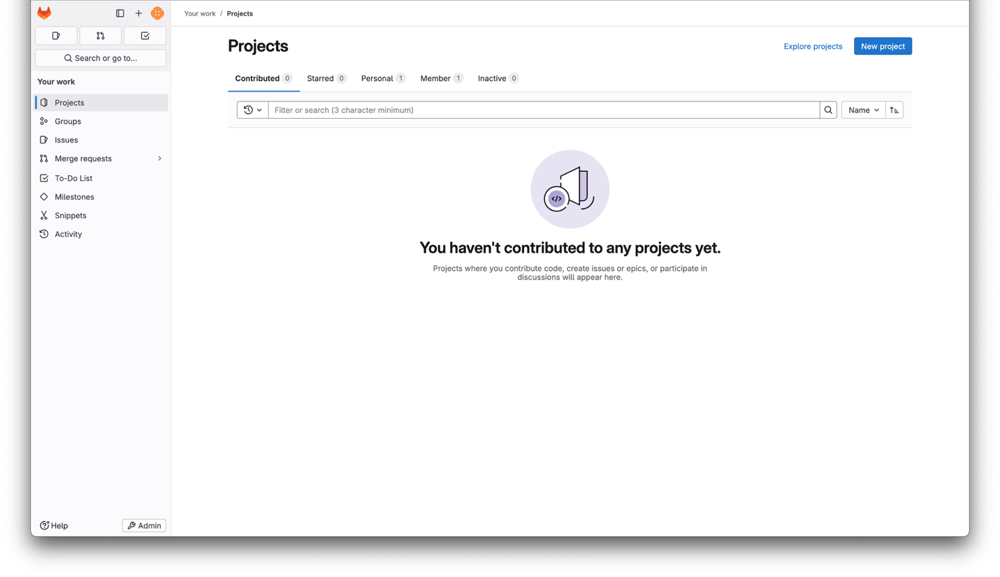
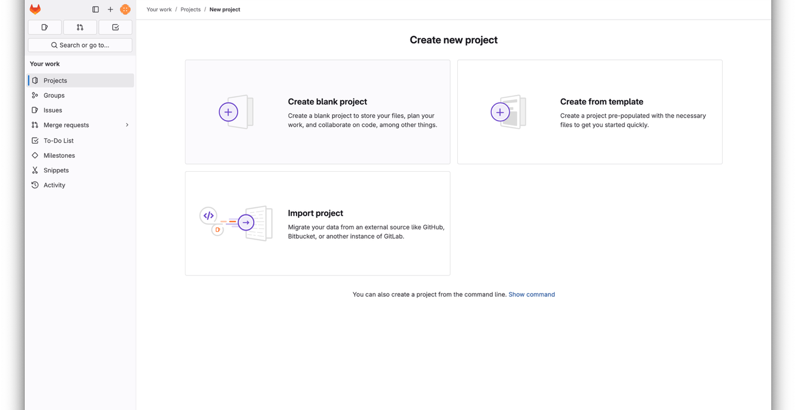
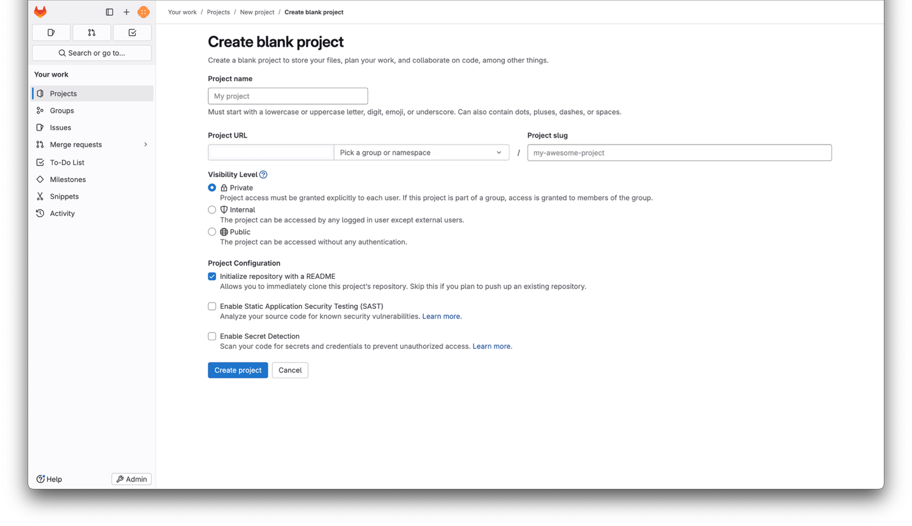
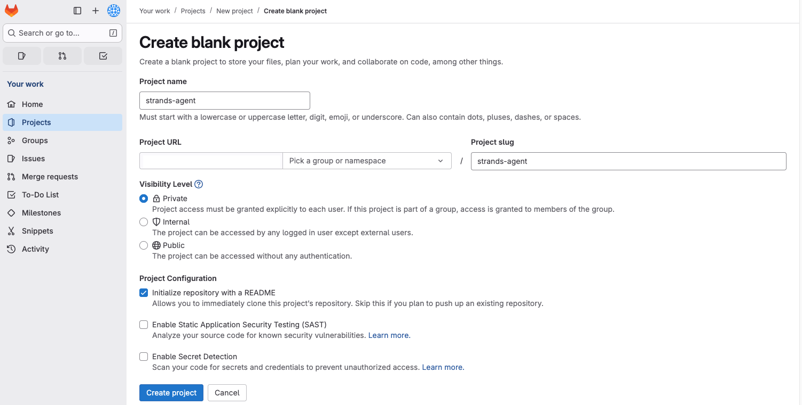
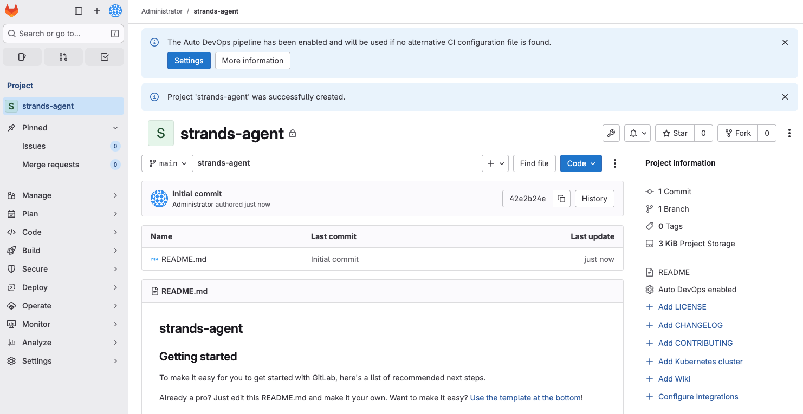
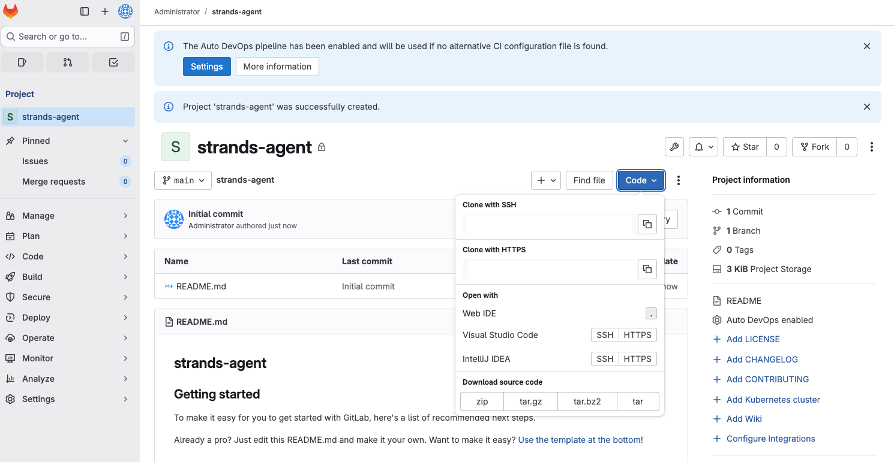
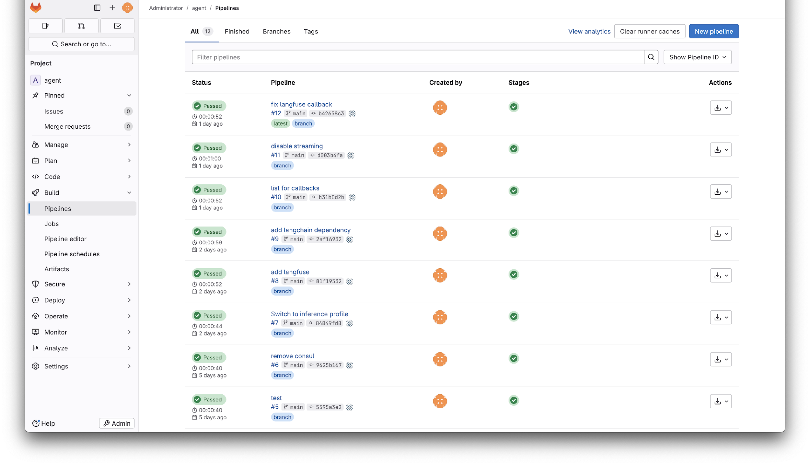

# EKS에서 에이전트 구축 및 배포

이 가이드는 Agents on EKS 환경을 사용하여 개발한 에이전트를 프로덕션에서 실행하는 방법을 안내합니다. 소스 제어에 코드 푸시, CI/CD를 통한 컨테이너 이미지 빌드, Kubernetes 배포, AWS 서비스 액세스 구성까지의 전체 워크플로우를 다룹니다.

## 사전 요구 사항

시작하기 전에 다음을 준비하세요:

- [Agents on EKS 인프라](https://awslabs.github.io/ai-on-eks/docs/infra/agents-on-eks)가 배포되어 있어야 합니다
- 로컬에서 실행 가능한 에이전트 (에이전트 코드 구조화에 대한 [에이전트 개발 모범 사례](./best-practices.md)와 [Strands Agents SDK](https://strandsagents.com) 참조)
- EKS 클러스터에 액세스할 수 있도록 `kubectl`이 구성되어 있어야 합니다
- Docker Desktop 또는 Podman이 로컬에 설치되어 있어야 합니다

:::note
환경의 공개 인터넷 노출 면적을 최소화하기 위해 가능한 한 포트 포워딩을 사용합니다. 이것이 로드 밸런서에서 허용하는 인바운드 CIDR 범위로 IP 주소를 설정하도록 안내하는 이유이기도 합니다. IP 제한을 제거하거나 환경의 더 많은 부분을 공개 인터넷에 노출하는 것도 가능합니다 (예: LangFuse 또는 에이전트). 이를 위해서는 직접 인그레스를 생성해야 합니다.
:::

## 에이전트 컨테이너화

에이전트가 환경에서 실행되려면 컨테이너 이미지로 패키징해야 합니다. 의존성을 위한 `requirements.txt`를 유지해왔다면 `Dockerfile`만 있으면 됩니다:

```dockerfile
FROM python:3.13-slim
WORKDIR /app
COPY requirements.txt /app
RUN pip install -r requirements.txt
COPY * /app
CMD python entrypoint.py
```

:::tip
로컬에서 `python -V` 출력을 확인하고 `FROM` 줄의 버전을 일치시켜 로컬 환경과 컨테이너 간의 호환성 문제를 방지하세요.
:::

로컬에서 빌드 및 테스트:

```bash
docker build -t strands-agent .
docker run --rm -p 8000:8000 \
  -e AWS_ACCESS_KEY_ID \
  -e AWS_SECRET_ACCESS_KEY \
  -e AWS_REGION \
  strands-agent
```

다음 단계로 넘어가기 전에 에이전트가 올바르게 응답하는지 확인하세요. 컨테이너에서 로컬로 작동하면 환경에서도 동일하게 작동합니다.

## GitLab에 코드 푸시

환경에는 소스 제어, 컨테이너 레지스트리, CI/CD를 위한 GitLab 인스턴스가 포함되어 있습니다. GitLab에 로그인하여 새 프로젝트를 생성합니다:

`root` 사용자의 비밀번호 확인:

```bash
kubectl get secret -n gitlab gitlab-gitlab-initial-root-password -o jsonpath="{.data.password}" | base64 --decode
```

사용자명: root, 위에서 확인한 비밀번호로 로그인













리포지토리를 클론하고 에이전트 파일을 추가합니다:

```bash
git clone https://gitlab.<your-domain>/root/strands-agent.git
cd strands-agent

# 에이전트 파일을 이 디렉토리에 복사한 후:
git add .
git commit -m "initial commit"
git push origin main
```

## CI/CD 설정

리포지토리에 `.gitlab-ci.yml` 파일을 추가하여 GitLab이 커밋할 때마다 자동으로 컨테이너 이미지를 빌드하고 내부 레지스트리에 푸시하도록 합니다:

```yaml
build-rootless:
  image: moby/buildkit:rootless
  stage: build
  variables:
    BUILDKITD_FLAGS: --oci-worker-no-process-sandbox
  before_script:
    - mkdir -p ~/.docker
    - echo "{\"auths\":{\"$CI_REGISTRY\":{\"username\":\"$CI_REGISTRY_USER\",\"password\":\"$CI_REGISTRY_PASSWORD\"}}}" > ~/.docker/config.json
  script:
    - |
      buildctl-daemonless.sh build \
        --frontend dockerfile.v0 \
        --local context=. \
        --local dockerfile=. \
        --output type=image,name=$CI_REGISTRY_IMAGE:$CI_COMMIT_SHA,push=true
```

파이프라인 파일을 푸시합니다:

```bash
git add .gitlab-ci.yml
git commit -m "add CI/CD pipeline"
git push
```

다음 푸시 후 GitLab의 파이프라인 뷰에서 빌드 실행을 확인할 수 있습니다:



파이프라인 단계의 녹색 체크 표시를 클릭하고 작업 이름을 클릭하면 빌드 출력을 볼 수 있습니다. 하단에서 레지스트리의 전체 이미지 이름을 확인할 수 있습니다:

```text
pushing manifest for registry.domain.tld/root/strands-agent:<commit-sha>@sha256:<digest>
```

이미지를 풀링하고 로컬에서 실행하여 작동을 확인할 수 있습니다. 처음 `docker pull` 시 GitLab 자격 증명을 입력해야 합니다:

```bash
docker run --rm -p 8000:8000 \
  -e AWS_ACCESS_KEY_ID \
  -e AWS_SECRET_ACCESS_KEY \
  -e AWS_REGION \
  registry.domain.tld/root/strands-agent:<commit-sha>
```

이 시점부터 리포지토리에 커밋할 때마다 레지스트리에 새로운 태그가 지정된 이미지가 생성되어 배포할 준비가 됩니다.

## Kubernetes에 배포

### 네임스페이스 생성

네임스페이스는 리소스를 그룹화하고 격리를 제공합니다. 에이전트용 네임스페이스를 생성합니다:

```bash
kubectl create namespace strands-agent
```

### 서비스 어카운트 생성

서비스 어카운트는 레지스트리에서 이미지를 풀링하고 Pod Identity를 통해 AWS 서비스에 인증하는 역할을 합니다:

```bash
kubectl create serviceaccount -n strands-agent strands-agent
```

### 레지스트리 액세스 구성

GitLab에서 `read_registry` 범위를 가진 [배포 토큰](https://docs.gitlab.com/user/project/deploy_tokens/#create-a-deploy-token)을 생성합니다. 그런 다음 해당 자격 증명으로 Kubernetes 시크릿을 생성합니다:

```bash
kubectl create secret docker-registry regcred \
  -n strands-agent \
  --docker-server=registry.<your-domain> \
  --docker-username=gitlab+deploy-token-1 \
  --docker-password=<TOKEN>
```

자격 증명을 서비스 어카운트에 연결합니다:

```bash
kubectl patch serviceaccount -n strands-agent strands-agent \
  -p '{"imagePullSecrets": [{"name": "regcred"}]}'
```

:::note
각 GitLab 리포지토리에는 자체 배포 토큰이 필요합니다. 이것이 레지스트리 액세스를 단일 리포지토리로 범위를 제한하는 가장 안전한 접근 방식이지만, 확장 시 리포지토리당 토큰이 필요합니다.
:::

### Deployment 생성

다음을 `deployment.yaml`로 저장하고 이미지 참조를 레지스트리 이미지로 교체합니다:

```yaml
apiVersion: apps/v1
kind: Deployment
metadata:
  name: strands-agent
  namespace: strands-agent
  labels:
    app: strands-agent
spec:
  replicas: 1
  selector:
    matchLabels:
      app: strands-agent
  template:
    metadata:
      labels:
        app: strands-agent
    spec:
      containers:
        - name: agent
          image: registry.<your-domain>/root/strands-agent:<commit-sha>
          ports:
            - containerPort: 8000
      serviceAccountName: strands-agent
---
apiVersion: v1
kind: Service
metadata:
  name: strands-agent
  namespace: strands-agent
spec:
  ports:
    - port: 8000
      targetPort: 8000
      protocol: TCP
      name: http
  selector:
    app: strands-agent
```

배포합니다:

```bash
kubectl apply -f deployment.yaml
```

## Pod Identity로 AWS 액세스 구성

에이전트가 AWS 서비스 (Bedrock, S3 등)에 액세스해야 하는 경우, IAM 자격 증명을 환경 변수로 전달하는 대신 [Pod Identity](https://docs.aws.amazon.com/eks/latest/userguide/pod-identities.html)를 사용하세요. Pod Identity 에이전트는 이미 환경에서 실행 중입니다.

Pod Identity Role을 생성할 때 역할에 Bedrock 권한을 추가해야 합니다.

새 자격 증명을 적용하기 위해 에이전트를 재배포합니다:

```bash
kubectl rollout restart deployment/strands-agent -n strands-agent
```

## 배포 확인

Pod가 실행 중인지 확인합니다:

```bash
kubectl get pods -n strands-agent
```

```text
NAME                        READY   STATUS    RESTARTS   AGE
strands-agent-7ddfd847b4-9x4xs   1/1     Running   0          2m36s
```

로그를 확인합니다:

```bash
kubectl logs -n strands-agent -l app=strands-agent
```

```text
INFO:     Started server process [7]
INFO:     Waiting for application startup.
INFO:     Application startup complete.
INFO:     Uvicorn running on http://0.0.0.0:8000 (Press CTRL+C to quit)
```

포트 포워딩으로 테스트합니다:

```bash
kubectl port-forward -n strands-agent svc/strands-agent 8000
```

다른 터미널에서:

```bash
curl --location 'http://localhost:8000/' \
--header 'Content-Type: application/json' \
--data '{"request": "Hello"}'
```

에이전트가 이제 Kubernetes에서 실행되며 클러스터의 모든 서비스에서 접근 가능합니다.

## 에이전트 업데이트

배포된 에이전트를 업데이트하는 워크플로우는 다음과 같습니다:

1. 로컬에서 코드를 변경하고 테스트합니다
2. GitLab에 커밋하고 푸시합니다
3. CI/CD 파이프라인이 커밋 SHA로 태그된 새 이미지를 빌드합니다
4. `deployment.yaml`의 이미지 참조를 업데이트하고 다시 적용하거나, `kubectl set image`를 사용하여 즉시 업데이트합니다:

```bash
kubectl set image deployment/strands-agent \
  -n strands-agent \
  agent=registry.<your-domain>/root/strands-agent:<new-commit-sha>
```

## 다음 단계

- [에이전트 개발 모범 사례](./best-practices.md) — 에이전트 코드 구조화, 테스트 및 API 래핑 패턴
